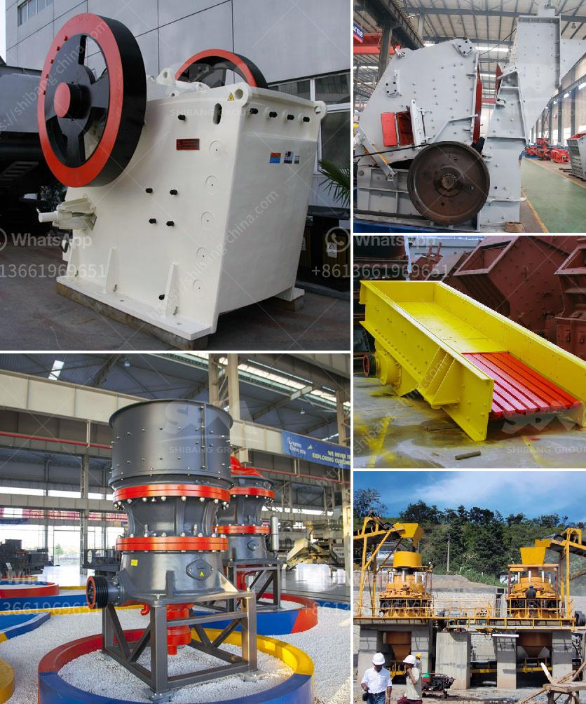

<h3>indonesia ball mills in peru</h3>
The Indonesian mining industry has shown substantial growth over the past few years, and this trend is set to continue. The government's efforts to attract foreign investment and streamline mining regulations have been successful, making Indonesia a hotspot for international mining companies. One such collaboration that has caught the attention of many experts is the partnership between Indonesia and Peru in the field of ball mills.

Ball mills are essential tools in the mining industry, used to grind down ores and extract valuable metals. Indonesia, with its abundant mineral resources, has a huge demand for ball mills. Peru, on the other hand, is a leading global supplier of ball mills, owing to its superior quality raw materials and advanced manufacturing techniques.

The collaboration between Indonesia and Peru in the ball mill industry is a mutually beneficial one. Indonesia gets access to high-quality ball mills, which are crucial for its mining sector's growth. Meanwhile, Peru gains a new market for its ball mills, allowing the country to expand its export potential and generate more revenue.

One of the key reasons why Peru's ball mills are highly sought after is their exceptional manufacturing quality. Peruvian manufacturers have honed their skills over the years, leveraging their abundant mineral resources to produce top-notch ball mills. These mills are known for their durability, efficiency, and high performance. They are perfectly suited for grinding various materials, including ores, rocks, and minerals.

Moreover, Peru's ball mill industry has prioritized innovation and sustainability. Manufacturers have developed advanced technologies and environmentally friendly processes to produce these mills. By ensuring optimal resource utilization and minimizing waste and energy consumption, Peru's ball mills meet the global demand for sustainable solutions, aligning perfectly with Indonesia's commitment to responsible mining practices.

In recent years, many Indonesian mining companies have turned to Peru for their ball mill needs. The geographical proximity and existing trade ties between the two countries make this collaboration all the more beneficial. Additionally, Peru's ball mill manufacturers offer competitive pricing, making their products attractive for Indonesian buyers.

This collaboration is not limited to commercial transactions alone. Indonesian mining companies also rely on Peruvian technical expertise to optimize the performance of their ball mills. Peru's experienced engineers provide guidance on installation, maintenance, and operation, ensuring that the mills operate efficiently and achieve maximum productivity. This knowledge transfer helps Indonesian miners enhance their operational capabilities and improve their overall mining processes.

In conclusion, the collaboration between Indonesia and Peru in the field of ball mills has proven to be a win-win situation for both countries. Indonesia, with its thriving mining industry, gains access to top-quality ball mills from Peru, facilitating its mining activities and boosting its economic growth. Peru, on the other hand, expands its market and strengthens its position as a leading global supplier of ball mills. This partnership showcases the power of international collaborations and highlights the potential for growth and innovation when nations join forces.
<h3>Contact us</h3><ul><li><strong>Whatsapp:&nbsp;<a href="https://wa.me/8613661969651">+8613661969651</a></strong></li><li><a href="https://swt.shibang-china.com/?git&amp;zhl&amp;indonesia ball mills in peru"><strong>Online Service(chat now)</strong></a></li></ul><h3>Related</h3><ul><li><a href='used ft crusher for sale.md'>used ft crusher for sale</a></li><li><a href='cement factory for sale india.md'>cement factory for sale india</a></li><li><a href='micro powder grinder mill.md'>micro powder grinder mill</a></li><li><a href='stone crusher united states project.md'>stone crusher united states project</a></li><li><a href='grinding mill machine.md'>grinding mill machine</a></li></ul>