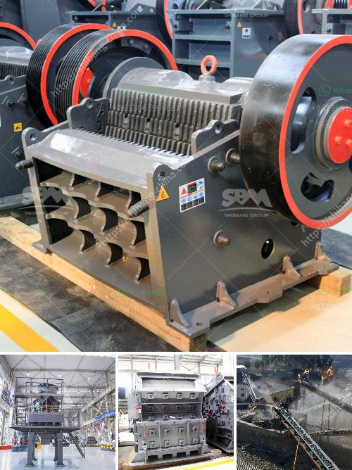

<h3>indonesia coal screen machine</h3>
In recent years, Indonesia has emerged as one of the leading producers and exporters of coal globally. With vast reserves of this natural resource, the country has fueled its economic growth while facing challenges related to efficient extraction and processing techniques. One key innovation that has played a pivotal role in revolutionizing the mining industry is the Indonesia coal screen machine.

The coal screen machine is a state-of-the-art equipment designed to extract coal from mines efficiently and effectively. Unlike traditional methods, such as manual labor or using heavy machinery, this innovative device offers a faster and more productive solution for coal extraction. Its implementation in Indonesia has significantly improved the country's coal mining operations, allowing for increased productivity and profitability.

The primary function of the coal screen machine is to sort and separate coal particles based on their size. It consists of a vibrating screen with multiple layers, which enables the separation of different sizes of coal particles. This process not only enhances the quality of the coal but also eliminates impurities and foreign materials, making it suitable for commercial use.

The Indonesia coal screen machine incorporates advanced technologies to ensure optimal performance and productivity. It is equipped with high-quality vibrating motors that generate strong vibrations, ensuring efficient separation of coal particles. Furthermore, the machine is built with robust materials that can withstand the rigors of the mining environment, ensuring durability and longevity.

One of the most significant advantages of the coal screen machine is its ability to handle high volumes of coal. It has a large processing capacity, enabling the screening of tons of coal per hour. This high throughput capability has revolutionized the coal mining industry in Indonesia, allowing for increased production rates and faster turnaround times.

The coal screen machine also offers improved safety measures for workers involved in the mining operations. By automating the screening process, it reduces the dependence on manual labor, eliminating the risk of accidents and injuries. This technological advancement has not only made mining operations more efficient but also created a safer working environment for the workforce.

Indonesia's adoption of the coal screen machine has not only improved its own coal mining industry but also contributed to the global coal market. The country's enhanced capacity to produce high-quality coal has allowed it to become a major player in the international coal trade. Moreover, the increased efficiency has enabled Indonesia to meet the growing demands of domestic and international markets, fueling economic growth and development.

In conclusion, the Indonesia coal screen machine has revolutionized the country's mining industry. With its advanced technologies and high processing capacity, it has significantly improved productivity, profitability, and safety in coal mining operations. Moreover, it has elevated Indonesia's position as a global coal exporter, contributing to the growth and development of the nation's economy. As the mining industry continues to evolve, it is essential to embrace such technological advancements to ensure sustainable and efficient extraction of natural resources.
<h3>Contact us</h3><ul><li><strong>Whatsapp:&nbsp;<a href="https://wa.me/8613661969651">+8613661969651</a></strong></li><li><a href="https://swt.shibang-china.com/?git&amp;zhl&amp;indonesia coal screen machine"><strong>Online Service(chat now)</strong></a></li></ul><h3>Related</h3><ul><li><a href='coal crusher manufacturer in mumbai.md'>coal crusher manufacturer in mumbai</a></li><li><a href='used vertical grinding machine.md'>used vertical grinding machine</a></li><li><a href='crusher machine philippine distributor and price.md'>crusher machine philippine distributor and price</a></li><li><a href='big crushing machine.md'>big crushing machine</a></li><li><a href='packing plant in cement industry.md'>packing plant in cement industry</a></li></ul>