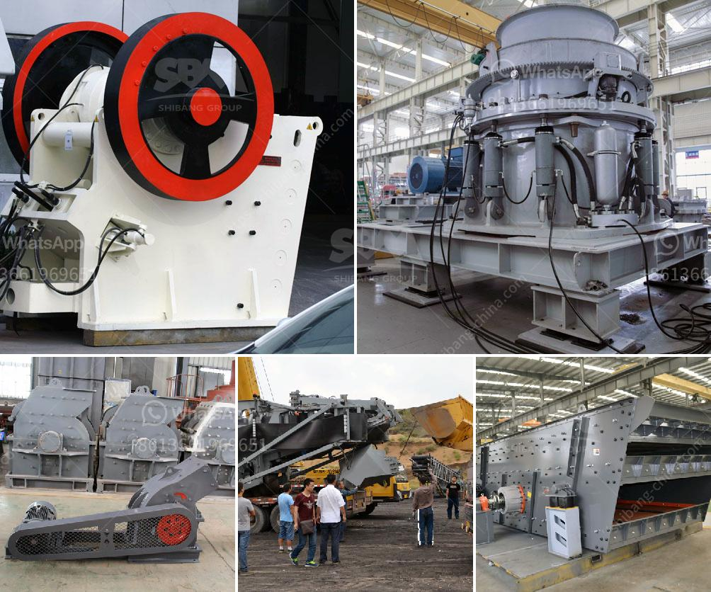

<h3>indonesia hammer mill for sale</h3>
Indonesia, as one of the largest agricultural countries in the world, boasts a vast array of crops including rice, corn, soybeans, and palm oil. With such abundant resources, the country holds tremendous potential for agribusiness development. One essential piece of equipment that supports this industry is the hammer mill. It is widely used in the agricultural sector for grinding grains and various other materials.

A hammer mill is a machine that crushes materials into small particles through repeated blows of hammers. These machines have been utilized since ancient times, but modern hammer mills offer enhanced efficiency, versatility, and convenience. In Indonesia, the demand for hammer mills has been steadily increasing, driven by the growth of the agriculture sector and the need to process agricultural waste.

Indonesian farmers often face difficulties when it comes to processing their produce efficiently. Traditional methods of grinding and crushing grains and agricultural waste are time-consuming and labor-intensive. By investing in a hammer mill, farmers can significantly increase their productivity, reduce processing time, and improve the quality of their products.

One of the key advantages of a hammer mill is its ability to crush various types of materials. It is commonly used to pulverize grains such as rice, corn, and wheat, making them suitable for animal feed or further processing into flour. Additionally, a hammer mill can process agricultural waste such as corn stalks, rice straw, and oil palm empty fruit bunches (EFB). By converting these waste materials into valuable biomass, farmers can contribute to a more sustainable agricultural system while generating additional income.

Another benefit of a hammer mill is its ability to produce consistent and uniform particle sizes. This is crucial, especially for the animal feed industry, where precise particle sizes are required to ensure optimal nutrition for livestock. Additionally, uniform particle sizes facilitate the efficient mixing of ingredients, resulting in high-quality feed with balanced nutrition.

In recent years, there has been a growing market for organic and natural products worldwide. As consumers seek healthier and more sustainable options, the demand for organic animal feed has surged. Hammer mills are essential for organic farmers who need to process organic grains and produce organic animal feed. By investing in a hammer mill, Indonesian farmers can tap into this lucrative market and benefit from the increasing demand for organic and natural products.

Fortunately, Indonesia offers a wide range of hammer mills for sale, catering to various needs and budgets. Local manufacturers produce a good number of these machines, ensuring availability and affordability. Additionally, the government supports the agriculture sector by providing subsidies and incentives for farmers and agribusinesses. This makes it even more enticing for farmers to invest in a hammer mill and enhance their productivity.

In conclusion, Indonesia presents a promising investment opportunity for those looking to purchase a hammer mill. The country's thriving agriculture sector, growing demand for processed agricultural products, and government support make it an ideal destination for such an investment. By acquiring a hammer mill, farmers can boost their efficiency, increase their income, and contribute to sustainable agricultural practices. Therefore, now is the time to seize this opportunity and join the booming agricultural industry in Indonesia.
<h3>Contact us</h3><ul><li><strong>Whatsapp:&nbsp;<a href="https://wa.me/8613661969651">+8613661969651</a></strong></li><li><a href="https://swt.shibang-china.com/?git&amp;zhl&amp;indonesia hammer mill for sale"><strong>Online Service(chat now)</strong></a></li></ul><h3>Related</h3><ul><li><a href='crusher machine philippine distributor and price.md'>crusher machine philippine distributor and price</a></li><li><a href='components of mobile coal processing plant.md'>components of mobile coal processing plant</a></li><li><a href='chrome ore concentrate plant.md'>chrome ore concentrate plant</a></li><li><a href='china jaw crusher importer in pakistan.md'>china jaw crusher importer in pakistan</a></li><li><a href='crusher mill for china price.md'>crusher mill for china price</a></li></ul>