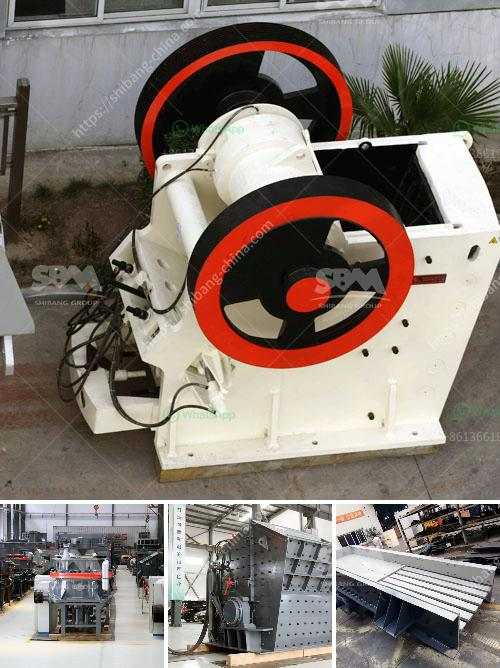

<h3>industrial ball mill</h3>
Industrial ball mills are used in various industries for grinding and mixing materials. During the ball milling process, materials are subjected to mechanical forces such as impact, compression, and friction, resulting in the reduction of particle size and even dispersion of particles. These machines are widely used in mineral processing, pyrotechnics, paints, ceramics, and selective laser sintering.

The basic operation of an industrial ball mill involves a rotating cylinder with cascading grinding media. As the materials tumble inside the mill, the grinding media crushes and grinds the material into fine particles. As the mill rotates, the material and grinding media collide and grind against each other, creating particles of varying sizes and shapes.

One of the key advantages of an industrial ball mill is its versatility. This machine can perform a wide range of tasks, from milling and grinding to mixing and blending. It can handle both dry and wet materials, making it suitable for a variety of applications. Different types of grinding media, such as steel balls, ceramic beads, or pebbles, can be used to suit different material requirements.

Another advantage of industrial ball mills is their ability to operate continuously for long periods. This allows for high-capacity production and consistent performance. In addition, the continuous operation reduces the chances of equipment damage and increases overall efficiency.

Industrial ball mills also offer a high degree of control over the grinding process. Engineers and operators can adjust multiple variables such as rotational speed, grinding media size and type, milling duration, and material feed rate to achieve the desired particle size distribution and product quality. This level of control is crucial in industries where precise particle size control is essential, such as in the production of pigments and other fine chemicals.

The design and construction of industrial ball mills have evolved over time to meet the demands of various industries. Modern mills are typically made of stainless steel or rubber-lined steel to prevent corrosion and minimize contamination of the product. They are also equipped with safety features such as overload protection and temperature monitoring to ensure safe and reliable operation.

However, industrial ball mills also have some limitations. For instance, they can be noisy and require regular maintenance to ensure optimal performance. Additionally, the grinding process can generate heat, which may require cooling systems to prevent overheating and maintain the desired temperature.

In conclusion, industrial ball mills are an essential tool in various industries for grinding, mixing, and blending materials. They offer versatility, control over the grinding process, and continuous operation for high-capacity production. Despite their limitations, industrial ball mills are widely used due to their ability to achieve desired particle size distribution and product quality. As technology continues to advance, these machines will continue to evolve, further improving their efficiency and performance.
<h3>Contact us</h3><ul><li><strong>Whatsapp:&nbsp;<a href="https://wa.me/8613661969651">+8613661969651</a></strong></li><li><a href="https://swt.shibang-china.com/?git&amp;zhl&amp;industrial ball mill"><strong>Online Service(chat now)</strong></a></li></ul><h3>Related</h3><ul><li><a href='high energy ball mill india.md'>high energy ball mill india</a></li><li><a href='crusher supplier saudi.md'>crusher supplier saudi</a></li><li><a href='crusher run for sale in sabah.md'>crusher run for sale in sabah</a></li><li><a href='dolomite stone crusher manufacturers.md'>dolomite stone crusher manufacturers</a></li><li><a href='process of gravel quarrying crusher.md'>process of gravel quarrying crusher</a></li></ul>