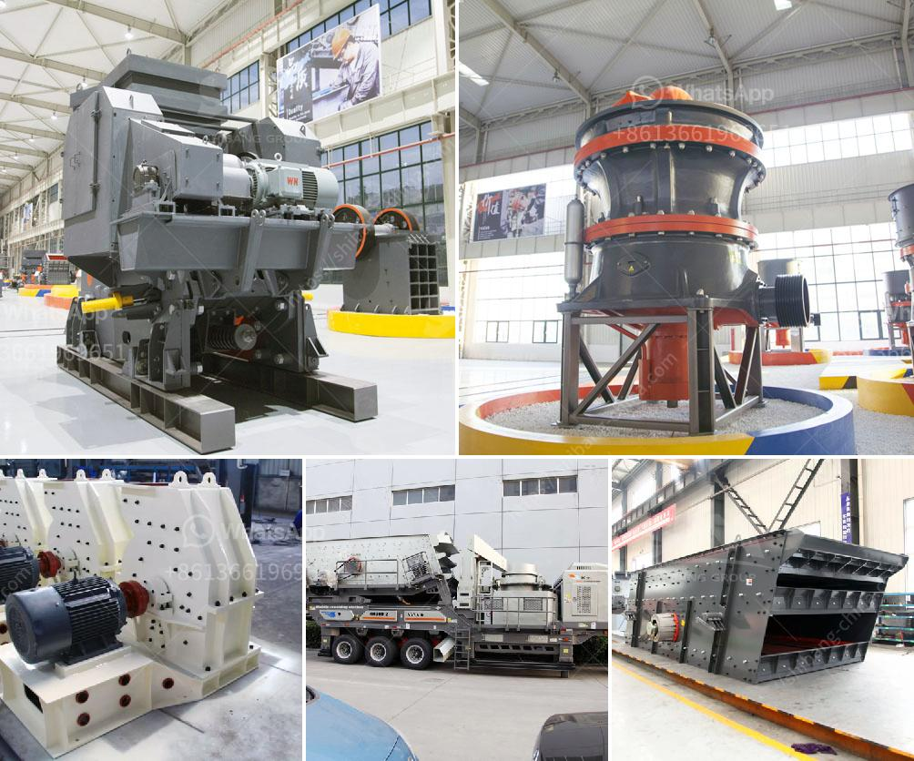

<h3>industrial jaw crushers</h3>
In the mining and aggregate industry, the primary use of industrial jaw crushers is to crush the material into smaller pieces. This reduces the burden on the conveyor belts, thereby improving the operational efficiency of the plant and enhancing the overall productivity. Industrial jaw crushers are commonly used in industries such as mining, quarrying, and recycling.

One of the main advantages of using industrial jaw crushers is their versatility. These machines are capable of crushing a wide range of materials, including hard rock, ore, and bulk materials. They are commonly used in primary crushing stages, but they can also be used as secondary or tertiary crushers depending on the application.

The structure of industrial jaw crushers is relatively simple compared to other crushing equipment. The main components include the frame, eccentric shaft, large pulley, flywheel, toggle plate, toggle seat, gap adjustment screw, and tension rod. The motor drives the eccentric shaft to rotate through a V-belt and the toggle plate oscillates back and forth, crushing the material against the fixed jaw.

Industrial jaw crushers are designed with a large feed opening to accommodate even large-sized rocks. This allows for a higher throughput and faster processing of the material. Additionally, the deep crushing chamber and optimally aligned nip angle ensure excellent crushing performance and reduce the risk of material jamming.

Another advantage of industrial jaw crushers is their exceptional durability. These machines are built to withstand heavy-duty applications and harsh operating conditions. The high-quality construction materials, such as special alloy steels, ensure long-lasting performance and reduced maintenance requirements. The bearings and other critical components are also designed to ensure reliable operation and minimize downtime.

In addition to their robust construction, industrial jaw crushers are equipped with advanced features to enhance their efficiency and user-friendliness. For instance, some models have hydraulic systems that enable easy and quick adjustment of the closed side setting. This allows operators to fine-tune the crusher to meet the desired output size requirements.

Moreover, many industrial jaw crushers have a toggle plate overload protection system. In the event of an uncrushable material entering the crushing chamber, the toggle plate releases and allows the material to pass through without causing damage to the crusher. This feature helps to protect the machine and reduce the risk of costly breakdowns.

The versatility, durability, and reliability of industrial jaw crushers make them an essential tool in various industries. They are capable of handling a wide range of materials and can be used for a variety of applications. Whether it is mining, quarrying, or recycling, these machines deliver consistent and efficient crushing performance.

In conclusion, industrial jaw crushers are a versatile crushing solution for a wide range of industries. Their robust construction, advanced features, and exceptional performance make them indispensable for primary crushing applications. With continuous advancements in technology, these crushers will continue to play a vital role in improving productivity and reducing operational costs in the industrial sector.
<h3>Contact us</h3><ul><li><strong>Whatsapp:&nbsp;<a href="https://wa.me/8613661969651">+8613661969651</a></strong></li><li><a href="https://swt.shibang-china.com/?git&amp;zhl&amp;industrial jaw crushers"><strong>Online Service(chat now)</strong></a></li></ul><h3>Related</h3><ul><li><a href='calcium carbonate processing plant cost.md'>calcium carbonate processing plant cost</a></li><li><a href='coal charcoal crushing grinding machine small.md'>coal charcoal crushing grinding machine small</a></li><li><a href='sand and quarry importer in singapore.md'>sand and quarry importer in singapore</a></li><li><a href='metals alloys for ball mill.md'>metals alloys for ball mill</a></li><li><a href='chrome ore concentrate plant.md'>chrome ore concentrate plant</a></li></ul>