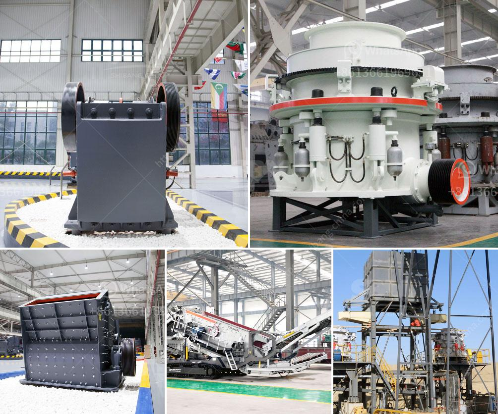

<h3>industrial micronized powder grinding mill</h3>
In various industries such as mining, agriculture, pharmaceuticals, and chemicals, micronized powder has become an essential ingredient. Micronized powder refers to small-sized particles that have been finely ground to ensure consistency and enhance their properties. To achieve this level of fineness, industrial micronized powder grinding mills are employed.

Industrial micronized powder grinding mills are specialized machines that grind materials into fine particles, ensuring uniformity in particle size and distribution. These mills are widely used in various industries due to their efficiency, versatility, and ability to produce high-quality powder.

One of the key advantages of using an industrial micronized powder grinding mill is its ability to grind a wide range of materials. Whether it is minerals like calcium carbonate or chemicals like gypsum, these mills can process numerous materials with different hardness levels. This versatility makes these mills indispensable in industries that require fine grinding.

Another advantage of industrial micronized powder grinding mills is that they enable precise control over particle size. These mills have various grinding mechanisms that allow operators to adjust the size of the final product according to their specific requirements. This level of control ensures consistent quality and enables industries to produce products with the desired properties.

In addition to particle size control, industrial micronized powder grinding mills offer high grinding efficiency. These mills are designed with advanced technology that maximizes the energy input during the grinding process. As a result, a greater proportion of the input energy is utilized for grinding, leading to higher productivity and reduced energy consumption.

The design of industrial micronized powder grinding mills also emphasizes ease of operation and maintenance. These mills are equipped with user-friendly interfaces and control systems that enable efficient operation and monitoring. Moreover, they are often designed to be modular, which facilitates easy maintenance and replacement of components, reducing downtime and increasing productivity.

Environmental consciousness is a paramount concern in modern industries, and industrial micronized powder grinding mills address this issue. These mills are engineered to have minimal environmental impact. Dust collection systems and exhaust fans are integrated into the mills, ensuring efficient containment of particles and preventing air pollution.

Overall, industrial micronized powder grinding mills offer a comprehensive solution for fine grinding in various industries. Their ability to grind a wide range of materials, precise control over particle size, high grinding efficiency, and ease of operation and maintenance make them essential equipment in numerous sectors.

In conclusion, industrial micronized powder grinding mills play a crucial role in industries that require fine grinding. They enable the production of micronized powder with consistent quality and desired properties. With their versatility, efficiency, and environmental friendliness, industrial micronized powder grinding mills are indispensable tools for achieving optimal particle size distribution and enhancing product performance in various applications.
<h3>Contact us</h3><ul><li><strong>Whatsapp:&nbsp;<a href="https://wa.me/8613661969651">+8613661969651</a></strong></li><li><a href="https://swt.shibang-china.com/?git&amp;zhl&amp;industrial micronized powder grinding mill"><strong>Online Service(chat now)</strong></a></li></ul><h3>Related</h3><ul><li><a href='crusher and screening plant.md'>crusher and screening plant</a></li><li><a href='project report clay brick manufacturing.md'>project report clay brick manufacturing</a></li><li><a href='stone crushing machine in china.md'>stone crushing machine in china</a></li><li><a href='second hand dry cleaning machines uk.md'>second hand dry cleaning machines uk</a></li><li><a href='advantages of reversible impact hammer crusher.md'>advantages of reversible impact hammer crusher</a></li></ul>