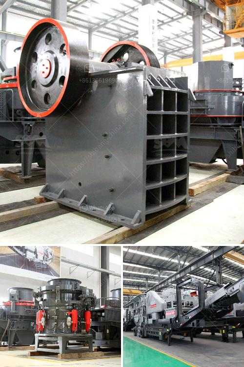

<h3>industrial vibrator feeders</h3>
In today's fast-paced industrial environments, the need for efficient and reliable material handling systems is paramount. Industrial vibrator feeders are revolutionizing the way materials are moved within manufacturing processes. These robust machines ensure a smooth and consistent flow of materials, increasing productivity and reducing downtime, contributing to overall operational efficiency.

Industrial vibrator feeders are mechanical devices that use vibration to transport and feed materials from a storage hopper to a processing or conveying system. They have become an integral part of various industries such as mining, pharmaceuticals, food processing, and automotive, to name a few. These machines are capable of handling a wide range of bulk materials, including powders, granules, and even heavy-duty materials.

One of the key advantages of industrial vibrator feeders is their ability to control and regulate the flow of materials. The vibration generated by these feeders enables precise and consistent material discharge rates, ensuring a steady supply to downstream processes. This control mechanism not only prevents material overflow or blockages but also minimizes the risk of damaging the processing equipment.

Another significant benefit of industrial vibrator feeders is their ability to handle a wide range of materials with different characteristics. These feeders can accommodate materials with varying sizes, shapes, and densities, making them versatile and adaptable to various production requirements. This flexibility significantly reduces the need for manual intervention and adjustments, enhancing overall operational efficiency.

The robust design and construction of industrial vibrator feeders make them highly suitable for harsh operating conditions. These machines are built to withstand heavy loads, extreme temperatures, and demanding environments, ensuring consistent performance and longevity. Moreover, their compact and space-saving design allows for easy integration into existing material handling systems, reducing installation costs and time.

In addition to their operational advantages, industrial vibrator feeders also contribute to the safety of the working environment. By automating the material handling process, these feeders reduce the need for manual handling and, thus, minimize the risk of workplace injuries. They also help in adhering to strict safety standards by preventing spillage, cross-contamination, and material waste.

To ensure optimal performance and efficiency, it is essential to choose the right type of industrial vibrator feeder for specific applications. Factors such as material characteristics, desired flow rates, and space limitations must be taken into account. Consulting with experienced suppliers and manufacturers can provide valuable insights and recommendations to select the most suitable feeder for your unique requirements.

In conclusion, industrial vibrator feeders are innovative solutions that enhance efficiency in material handling processes. Their ability to regulate material flow, handle diverse materials, withstand harsh conditions, and improve workplace safety make them valuable assets to industries worldwide. By investing in these advanced machines, businesses can optimize their productivity, reduce downtime, and ultimately improve their bottom line.
<h3>Contact us</h3><ul><li><strong>Whatsapp:&nbsp;<a href="https://wa.me/8613661969651">+8613661969651</a></strong></li><li><a href="https://swt.shibang-china.com/?git&amp;zhl&amp;industrial vibrator feeders"><strong>Online Service(chat now)</strong></a></li></ul><h3>Related</h3><ul><li><a href='multi hammer crusher.md'>multi hammer crusher</a></li><li><a href='gold mining machines manufacturers from italy.md'>gold mining machines manufacturers from italy</a></li><li><a href='small scale electric arc ferrochrome smelting.md'>small scale electric arc ferrochrome smelting</a></li><li><a href='small rock crusher for small scale aggregate producers.md'>small rock crusher for small scale aggregate producers</a></li><li><a href='stone crushers suppliers.md'>stone crushers suppliers</a></li></ul>