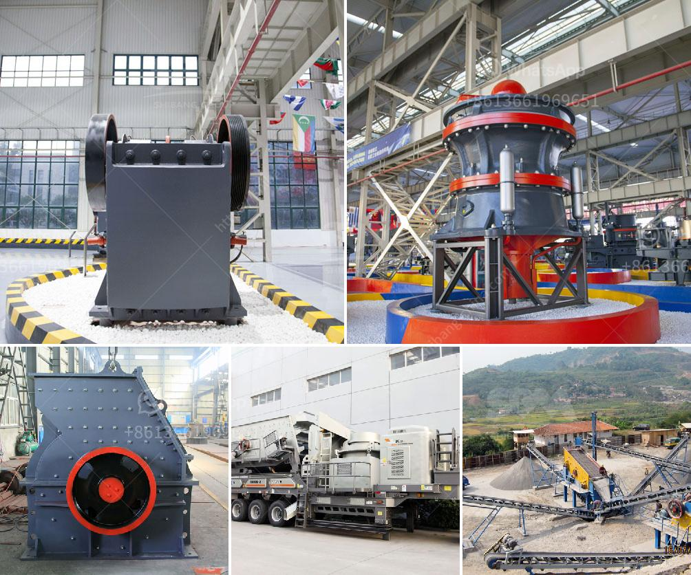

<h3>iron ore cruseher plant price</h3>
Iron ore crusher plant price, commonly applied in the iron ore industry, is a crushing apparatus used to break down iron ore into smaller fragments. Iron ore crushing machinery is a crucial step in iron ore mining operations, as it is capable of reducing the ore to a consistent size for easy handling and transportation. To enhance iron ore processing effectiveness, the crushing stage may be performed in two or three stages.

The iron ore crusher plant price, as well as the production capacity and ore grade, will differ depending on several factors. These factors include the amount of iron ore available, capital investment, infrastructure availability, and environmental regulations. However, the crusher plant price primarily depends on the equipment configuration and production capacity.

The configuration of the crusher plant may consist of jaw crushers for the primary crushing stage, cone crushers or impact crushers for the secondary stages, and vibrating screens to separate the crushed particles. The production capacity of the plant, expressed in tons per hour, will affect the total investment and overall operational costs.

Iron ore prices play a significant role in determining the feasibility of establishing a crusher plant. Fluctuating iron ore prices can influence the return on investment for the project. It is crucial for mining companies to evaluate various scenarios and assess the market demand to ensure profitable operations.

Furthermore, labor and equipment costs, energy consumption, and maintenance requirements also contribute to the overall price of the crusher plant. Maintenance costs can be managed by implementing preventive measures and utilizing durable and reliable equipment.

In summary, the iron ore crusher plant price is influenced by various factors. The amount and quality of iron ore deposits, capital investment, infrastructure availability, and environmental regulations all play a role in determining the feasibility of establishing a crusher plant. Additionally, equipment configuration, production capacity, and operational costs should also be considered. Proper evaluation and market analysis are essential to ensure a profitable investment in the iron ore mining industry.
<h3>Contact us</h3><ul><li><strong>Whatsapp:&nbsp;<a href="https://wa.me/8613661969651">+8613661969651</a></strong></li><li><a href="https://swt.shibang-china.com/?git&amp;zhl&amp;iron ore cruseher plant price"><strong>Online Service(chat now)</strong></a></li></ul><h3>Related</h3><ul><li><a href='types of diaphragm in ball mill.md'>types of diaphragm in ball mill</a></li><li><a href='gypsum board plant cost.md'>gypsum board plant cost</a></li><li><a href='gypsum granules plant manufacturer in india.md'>gypsum granules plant manufacturer in india</a></li><li><a href='marble granding machine price in india.md'>marble granding machine price in india</a></li><li><a href='crusher mill for china price.md'>crusher mill for china price</a></li></ul>