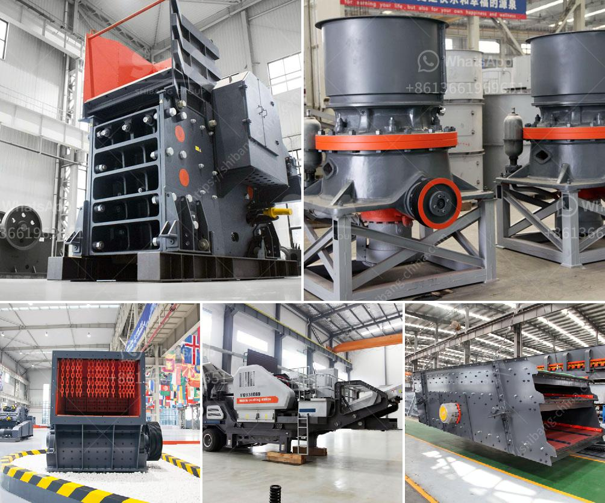

<h3>iron ore crusher cost</h3>
Iron ore crusher is a machine used in the mining and mineral industry for the breaking down of the materials to small and even sizes as per it is being required. It is very necessary in the mining and mineral industry to have perfect sized materials, which are achievable with our product.

Iron ore crusher has been widely used in large-scale industries as it is easy to process with high output. The amount of raw materials used in iron ore processing is enormous; therefore, it is treated as a high-cost material in the metallurgical industry. To extract the maximum value from iron ore, it is vital to process it effectively.

The cost of an iron ore crusher plays a crucial role in the overall cost of an iron ore processing plant. The processing plant cost is calculated at a dry weight basis and includes costs for handling, tailings treatment, and fines dewatering.

There are four types of iron ore crusher available in the market. Jaw crusher, which is used as primary crusher, Cone crusher, which is used for fine crushing, Impact crusher, which is used for further crushing, and Composite crusher, which is suitable for secondary and tertiary crushing.

The cost of an iron ore crusher is determined by the type of crusher used, such as jaw crushers as the primary crusher, cone crushers as the secondary crusher, and impact crushers as the tertiary crusher. The primary crusher costs less than the other crushers and has just one breaker plate, while the other crushers consist of one or more breaker plates.

The cost of an iron ore crusher varies depending on the size and capacity of the crusher, as well as the location and condition of the mine sites. The production capacity of an iron ore crusher is typically measured in tons per hour (TPH).

Additionally, the cost of an iron ore crusher also includes the cost of capital investment, maintenance, repair and operation (MRO) costs, energy consumption, and environmental concerns.

The cost of capital investment is the cost of purchasing and installing the crusher and any associated equipment. This cost includes the purchase price of the crusher, as well as the cost of transporting and installing it.

MRO costs include the cost of maintaining, repairing, and operating the crusher. These costs include labor, materials, and any other costs associated with keeping the crusher in working order.

Energy consumption is an important consideration in the overall cost of an iron ore crusher. The crusher's energy consumption is closely related to the crusher's capacity and speed. Higher capacity and faster speed usually result in higher energy consumption.

Lastly, the environmental concerns associated with iron ore crusher use must also be considered. Iron ore crushers can generate dust, noise, and other pollutants that can impact human health and the environment. Therefore, measures must be taken to control and mitigate these impacts.

In conclusion, the cost of an iron ore crusher is determined by several factors, including the type and capacity of the crusher, the location and condition of the mine sites, the cost of capital investment, MRO costs, energy consumption, and environmental concerns. By carefully considering these factors, companies can optimize their iron ore processing plants for maximum efficiency and cost-effectiveness.
<h3>Contact us</h3><ul><li><strong>Whatsapp:&nbsp;<a href="https://wa.me/8613661969651">+8613661969651</a></strong></li><li><a href="https://swt.shibang-china.com/?git&amp;zhl&amp;iron ore crusher cost"><strong>Online Service(chat now)</strong></a></li></ul><h3>Related</h3><ul><li><a href='gypsum crusher plants in pakistan.md'>gypsum crusher plants in pakistan</a></li><li><a href='china grinding unit.md'>china grinding unit</a></li><li><a href='high purity quartz processing companies.md'>high purity quartz processing companies</a></li><li><a href='russia copper ore crushing plant.md'>russia copper ore crushing plant</a></li><li><a href='hammer mill south africa.md'>hammer mill south africa</a></li></ul>