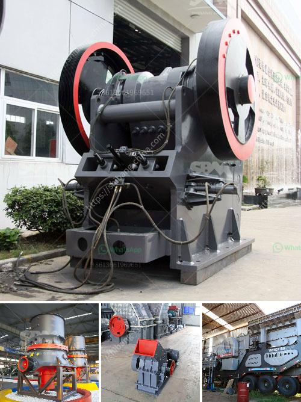

<h3>iron ore crusher plant</h3>
Iron ore crusher plant is a specialized production line aimed to produce high-quality iron ore materials. It has been generally used in the mining industry.

Choosing a suitable type of iron ore crusher plant is integral to the efficient production and processing of iron ore rocks. Iron ore is a type of mineral and rock from which metallic iron is extracted economically. This ore is normally rich in iron oxides and varies in color from dark grey, bright yellow and deep purple to rusty red. Iron ore itself is usually found in the form of magnetite, hematite, goethite, limonite or siderite.

The processed iron ore products with suitable size can be used in the blast furnace to make raw iron. The gravity separator and magnetic separator can upgrade the grade of iron ore. Different machines involved in iron ore beneficiation process includes crushing machine, grinding mill, screening machine, separation equipment, flotation machine, dewatering machine, etc.

The choice of the iron ore crusher plant is based on its hardness, wear resistance, moisture, reduction ratio, and other factors, including the specific application requirements and desired output size. It's clear that the primary crushing stage is critical as it is capable of minimizing the size of the iron ore particles and facilitating the further processing of iron ore. The choice of the crusher depends on the feed size of iron ore, material-specific gravity, and hardness.

Most common types of iron ore crushing equipment include the jaw crusher, cone crusher, hammer crusher, ball mill, ultrafine grinding mill, and iron ore screening machine. These machines will work with each other to complete the iron ore processing line. With the feeder, elevator, conveyor can form a complete iron ore crushing and screening plant.

The commonly used iron ore processing equipment are iron ore jaw crusher, impact crusher, cone crusher, iron ore grinding mill, iron ore separator, iron ore pelletizer, rotary dryer, iron ore screening equipment and so on. Almost all of the iron ore mining machines are designed and produced by SBM, a famous global mining equipment manufacturer.

Such crusher machines have a compact design and can be mounted on crawler tracks so they can be easily moved inside a quarry plant and transported between sites when necessary, which ensures the crushing plant can be easily transported on highways and moved to crushing sites quickly to save time. The mobile crushing plant greatly expands the concept of crushing operations. It significantly reduces the transportation cost involved in material processing. Hence, it is becoming increasingly popular among customers all over the world.

Iron ore crusher plant equipment is designed to process iron ore, and it is suitable for crushing various hard and medium hard ore and rock, such as iron ore, limestone, granite, basalt, quartz, etc. Iron ore crushing production line with a capacity of 100-150t/h is equipped with jaw crusher, cone crusher, vibrating screen, feeder, conveyor, sand washing machine, etc., which makes smooth feeding, reliable performance, and convenient operation.

In conclusion, iron ore crusher plant is widely used in mining, metallurgy, construction, highways, railways, water conservancy and chemical industry. It has a high crushing ratio and a stable performance. With 300-500 tons per hour, it's ideal for single-cylinder hydraulic cone crusher and can provide an unparalleled crushing performance in various medium crushing, fine crushing and super fine crushing operations.
<h3>Contact us</h3><ul><li><strong>Whatsapp:&nbsp;<a href="https://wa.me/8613661969651">+8613661969651</a></strong></li><li><a href="https://swt.shibang-china.com/?git&amp;zhl&amp;iron ore crusher plant"><strong>Online Service(chat now)</strong></a></li></ul><h3>Related</h3><ul><li><a href='high energy ball mill india.md'>high energy ball mill india</a></li><li><a href='cost of stone crushing machine stone crusher quarry.md'>cost of stone crushing machine stone crusher quarry</a></li><li><a href='marble production line germany.md'>marble production line germany</a></li><li><a href='fly ash processing plant.md'>fly ash processing plant</a></li><li><a href='cost estimates of a chrome processing plant.md'>cost estimates of a chrome processing plant</a></li></ul>