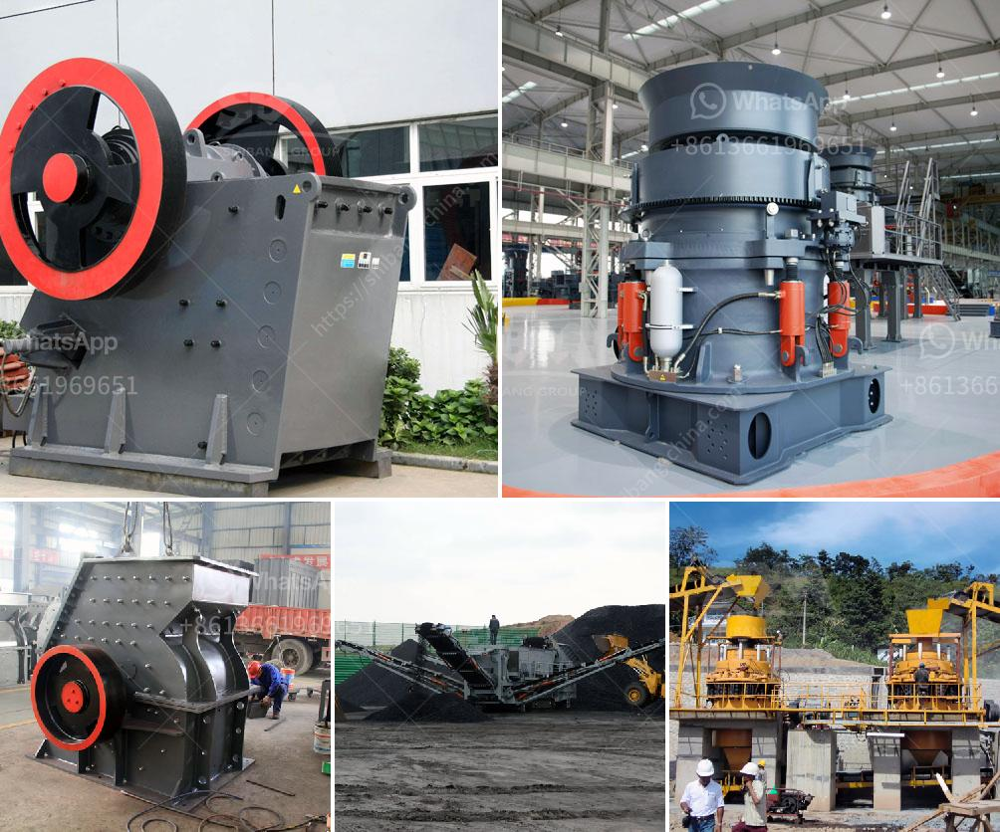

<h3>iron ore crushing equipment</h3>
Iron ore is a kind of hard ore and the size is large. Jaw stone crusher is the suitable iron ore crusher and can break the iron ore for primary crushing in the iron ore crushing plant. Most iron ore crushing plant adopts two stage crushing process for the high efficiency and large production. Designed by crushing large iron ore, jaw stone crusher can easily break the large iron ore into smaller particles. Jaw stone crusher can crush the raw material with hardness less than 320Mpa. After crushing, the materials will be transported to the magnetic separation, and then into the ball mill for grinding. Iron ore crushing plant with different production capacity is designed with different requirements.

From the feeding hopper, the materials will be fed into the jaw crusher evenly and gradually through the vibrating feeder for primary crushing. After the primary crushing, the raw material will be transported to the cone crusher for further crushing and grinding. When the materials are crushed to the required size, they will be discharged from the outlet. The cone crusher is widely used in metallurgical industry, construction industry, road building industry, chemical industry and phosphate industry. Cone crusher is suitable for crushing hard or medium hardness above all kinds of ores and rocks.

The cone crusher has higher speed stroke, so the rated power of the cone crusher is increased, and the processing capacity of the equipment is greatly improved. Thirdly, this rock crusher machine has a two-way iron release hydraulic cylinder, which allows the iron to go through the crushing chamber, and reduces the shutdown due to debris in the crushing chamber. Fourthly, large diameter spindle and heavy main frame ensure that the equipment has durable and reliable working condition.

The independent cone crusher can increase the iron ore production capacity through the unit crushing performance. The iron ore crushing plant is equipped with HP series iron ore crushing plant. This iron ore crushing plant is in Kolkata, India. Kolkata is India’s largest city, is the largest commercial city of the East. Joyal-iron crusher,stone crusher,mobile crusher plant,jaw crusher,impact crusher,cone crusher in Kolkata · Limestone and calcite grinding line in Saudi Riyadh · Slaked lime grinding plant in Jizzakh, Uzbekistan · 20tph LM150M Vertical Mill for coal powder production in Australia · Petrol Coke Grinding in India · 250-300tph coal gangue Mobile crushing line in Kurtz buss, Russia · Iron Ore Crushing Grinding Equipment Used For India List. We supply skilled service about iron ore mining technology and iron ore mining equipment for sale in India. The equipment used in iron ore mining which includes crushing equipment like jaw crusher, impact crusher, cone crusher, grinding equipment like ball mill, Raymond mill, super thin grinding mill and so on.
<h3>Contact us</h3><ul><li><strong>Whatsapp:&nbsp;<a href="https://wa.me/8613661969651">+8613661969651</a></strong></li><li><a href="https://swt.shibang-china.com/?git&amp;zhl&amp;iron ore crushing equipment"><strong>Online Service(chat now)</strong></a></li></ul><h3>Related</h3><ul><li><a href='crusher machine in china.md'>crusher machine in china</a></li><li><a href='density of crushed hornfels basalt granite.md'>density of crushed hornfels basalt granite</a></li><li><a href='price for china crusher.md'>price for china crusher</a></li><li><a href='barite grinding processing plant for sale.md'>barite grinding processing plant for sale</a></li><li><a href='cement grinding station quotations.md'>cement grinding station quotations</a></li></ul>