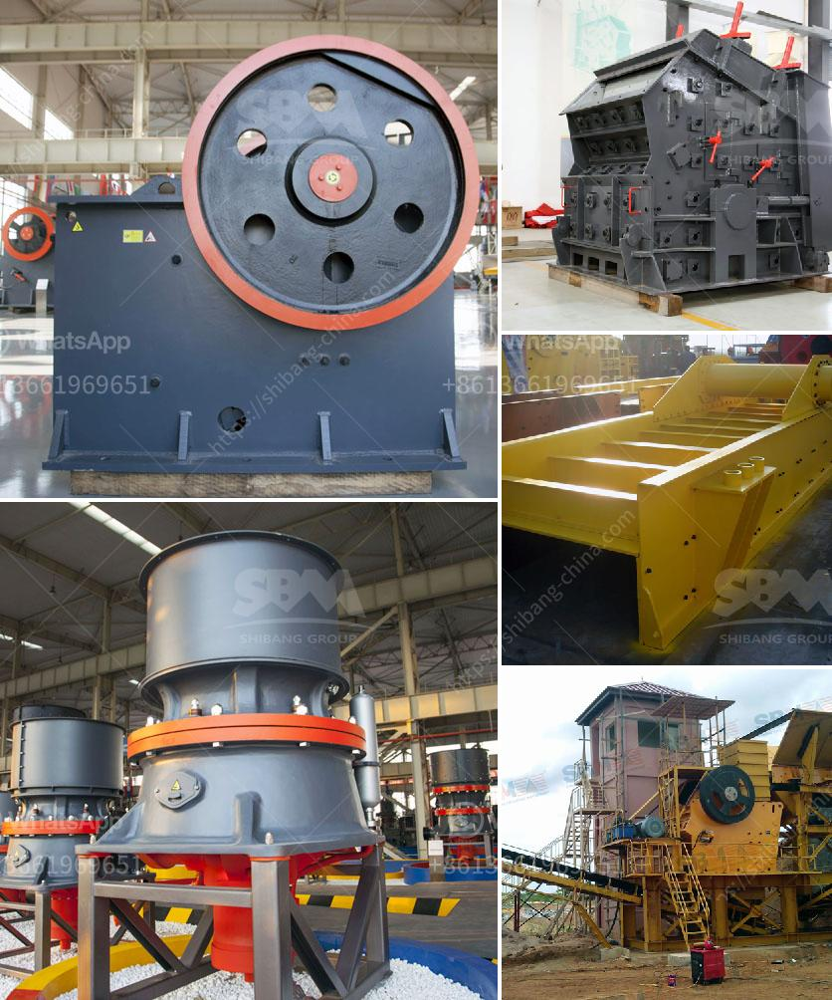

<h3>iron ore crushing plant in germany crusher</h3>
Iron ore is one of the most abundant resources in Germany. However, extracting and processing iron ore can be challenging and expensive. Crushing plant is a crucial step in iron ore mining processing production line.

Crusher with advanced technology and stable performance is the ideal choice for iron ore mining. Germany has rich iron ore reserves. From its inception to the present, the iron ore business in Germany has been developing rapidly, and the crushing technology continues to improve.

Nowadays, the crushing technology has been widely used in various fields, such as metallurgy, chemical industry, building materials, electric power, and transportation. The iron ore crushing plant in Germany adopts a unique crushing cavity design and fully utilizes the laminating crushing principle. It greatly improves the crushing efficiency and reduces the wear rate of vulnerable parts.

The production capacity of the iron ore crushing plant in Germany can reach up to 1000tph, and the final size is adjustable. From 0-5mm, 5-10mm, 10-20mm, 20-40mm to ≤40mm, it can be used as construction materials. Besides, this unique design greatly reduces the operation cost and maintenance cost. It is suitable for various processing stages, such as primary crushing, secondary crushing, and tertiary crushing.

In addition, the iron ore crushing plant in Germany is designed with advanced technology, which can ensure the stable performance and high crushing efficiency. It precisely controls the particle size of the final product, and the finished material is cubic, with a fine and uniform particle size. It meets the requirements of high-quality aggregate production.

In recent years, environmental protection has become an important topic of concern for the iron ore industry in Germany. The crusher in the iron ore crushing plant in Germany adopts an automatic lubrication system and reduces the oil consumption and maintenance frequency. It can control the dust pollution effectively, and the dust emission meets the national standards.

Furthermore, the iron ore crushing plant in Germany has the advantages of large capacity, low power consumption, easy maintenance and high crushing efficiency. It not only increases the output per unit time, but also expands the application range of iron ore. In addition, the production capacity of Germany crusher can be adjusted, which can meet the individual needs of customers.

Overall, the iron ore crushing plant in Germany plays an important role in the mining process, which contributes to the efficient production of iron ore. The Germany crusher can crush iron ore into small pieces. Iron ore crushing plant in Germany shows excellent performance in various secondary, tertiary, and quaternary crushing applications. It is not only a reliable and efficient part of the process but also a flexible and cost-effective solution for those seeking to optimize their operations.
<h3>Contact us</h3><ul><li><strong>Whatsapp:&nbsp;<a href="https://wa.me/8613661969651">+8613661969651</a></strong></li><li><a href="https://swt.shibang-china.com/?git&amp;zhl&amp;iron ore crushing plant in germany crusher"><strong>Online Service(chat now)</strong></a></li></ul><h3>Related</h3><ul><li><a href='manufacturers of stone crushers in usa.md'>manufacturers of stone crushers in usa</a></li><li><a href='grinding mill machine gebraucht.md'>grinding mill machine gebraucht</a></li><li><a href='quarrying crusher equipment.md'>quarrying crusher equipment</a></li><li><a href='coal crusher manufacturer in mumbai.md'>coal crusher manufacturer in mumbai</a></li><li><a href='used cement plant for sale germany.md'>used cement plant for sale germany</a></li></ul>