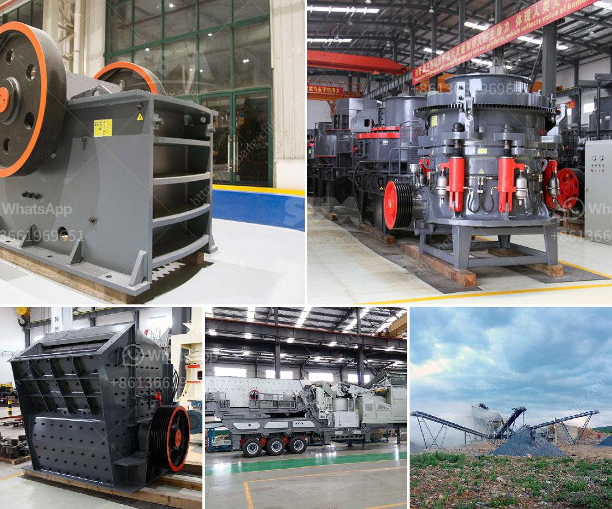

<h3>iron ore mobile crusher</h3>
Iron ore mobile crusher is developed according to novel series iron ore crushing equipment’s design idea, which expands the concept field of coarse crushing and fine crushing. iron mobile crusher is designed based on the conception of fully adapting various iron crushing condition, eliminating obstacles caused by location, environment, foundation configuration, consequently providing simple, efficient, low-cost crushing equipment. Our iron ore mobile crusher includes cone crusher series mobile crusher, impact crusher series mobile crusher, jaw crusher series mobile crusher and crawler type mobile crusher. This series iron ore crusher really supply simpler, higher efficient lower cost machines for clients.

Iron Cone Crusher Series crushing process is performed by two sets of cone crusher, in the first crusher, after transported to the scene, the large stone was evenly sent into the crusher chamber of the jaw crusher by vibrating feeder for coarse crushing, and then asked to the jaw crusher chamber for second crushing, what’s more, there are also other types of mobile crusher, such as: Mobile jaw crusher, Mobile cone crusher, Mobile impact crusher, as well as mobile crushing and screening station, etc.

As leading iron ore crusher seller, SBM high performance iron ore crushing plant for iron ore crushing process is widely used in India, Malaysia, Philippine. SBM iron ore crushing plant uses iron ore crusher, iron ore grinder mill for crushing process. Iron ore mining equipments supplier in Russia, Brazil, Canada.

Quarry and mining equipment for quarrying in Malaysia. quarry and mining equipment include stone crushing machine, belt conveyor, vibrating feeder, screen and washer used for limestone, kaolin, clay quarrying.

Mobile stone crusher is widely used in road & bridge construction, metallurgy and other fields to crusher and screen. Mobile stone crusher specially adopts jaw crusher as the core minerals crushing equipment.

Among all these mobile crusher plants, mobile jaw crusher plant is particularly suitable for hard rock crushing, such as taconite, granite, dark rock, corundum, Silicon carbide and quartzite, etc.

Mobile jaw crusher specially adopts jaw crusher as the core minerals crushing equipment. Among all these mobile crusher plants, mobile jaw crusher plant is particularly suitable for hard rock crushing, such as taconite, granite, dark rock, corundum, Silicon carbide and quartzite, etc.

Iron ore mobile crusher with low price aims to provide a range of stone crushing and stone milling solutions to customers around the world. The well-known brand Break-day(sometimes was also called Breakday) is our former brand for the international market. 

What we aim to do is to make the customers' decision and purchase easier by offering them the information and assistance they need. This is also our main goal when offering the support services that are our hallmark. We make sure that our clients always find topics that are of interest to them in our catalog.

Through continuous effort, our company has obtained more than 100 patents and authorizations for crushers and mills, and has been exported to more than 160 countries and regions, and has set up offices overseas to provide users with convenient services. We also have help our customers built many sand production lines in Saudi Arabia. 

Iron ore mobile crusher is developed according to novel series iron ore crushing equipment’s design idea, which expands the concept field of coarse crushing and fine crushing. SBM iron ore mobile crusher is designed based on the conception of fully adapting various iron crushing condition, eliminating obstacles caused by location, environment, foundation configuration, consequently providing simple, efficient, low-cost crushing equipment.
<h3>Contact us</h3><ul><li><strong>Whatsapp:&nbsp;<a href="https://wa.me/8613661969651">+8613661969651</a></strong></li><li><a href="https://swt.shibang-china.com/?git&amp;zhl&amp;iron ore mobile crusher"><strong>Online Service(chat now)</strong></a></li></ul><h3>Related</h3><ul><li><a href='difference between css or oss crusher.md'>difference between css or oss crusher</a></li><li><a href='barite crusher plant.md'>barite crusher plant</a></li><li><a href='germany stone crusher machine factories.md'>germany stone crusher machine factories</a></li><li><a href='how to find startup funding for a stone crushing business.md'>how to find startup funding for a stone crushing business</a></li><li><a href='low speed crusher suppliers in china.md'>low speed crusher suppliers in china</a></li></ul>