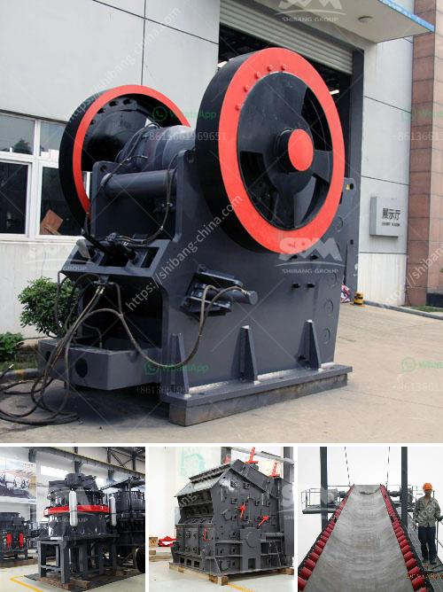

<h3>iron ore processing equipment china for sale</h3>
Iron ore is one of the most important industrial minerals worldwide, and China is the largest consumer and importer of iron ore in the world. As the demand for iron ore continues to rise, the need for iron ore processing equipment in China is also increasing.

China is the largest producer of iron ore in the world, accounting for over 45% of global production. Most of the country's iron ore is domestically mined and processed. However, China also imports significant amounts of iron ore from other countries, especially Australia and Brazil, to meet its growing demand.

Iron ore processing equipment is used in the mining and beneficiation process to extract and refine iron ore particles. China has a significant amount of iron ore reserves, estimated to be around 16 billion tons. The majority of these reserves are found in the provinces of Liaoning, Hebei, and Shanxi.

Iron ore processing equipment in China mainly includes crushing equipment, grinding equipment, magnetic separation equipment, and flotation equipment. These equipment have different functions and can be used alone or in combination to extract and refine iron ore particles.

Crushing equipment is used to reduce the size of large-sized iron ore particles into smaller-sized particles. This equipment includes jaw crushers, cone crushers, and impact crushers. Grinding equipment is used to further crush the crushed iron ore particles into fine particles. This equipment includes ball mills and grinding mills.

Magnetic separation equipment is used to separate magnetic minerals from non-magnetic minerals. This equipment includes magnetic separators, magnetic drum separators, and magnetic roll separators. Flotation equipment is used to separate valuable minerals from non-valuable minerals based on their different surface properties. This equipment includes flotation machines and flotation columns.

Many Chinese iron ore processing equipment manufacturers offer a wide range of equipment for sale. These manufacturers include Jiangxi, Hengcheng Mining Equipment Co., Ltd., Yantai Shandong Mining Machinery Co., Ltd., Henan Hongxing Mining Machinery Co., Ltd., and Zhengzhou Jinma Mining Machinery Co., Ltd. These manufacturers provide high-quality equipment that is efficient and reliable.

China's iron ore processing equipment market is highly competitive. Manufacturers are constantly striving to improve the design and performance of their equipment to meet the needs of customers. This has led to the development of advanced equipment with higher processing capacity, lower energy consumption, and better environmental performance.

With the increasing demand for iron ore and the development of new iron ore mines in China, the market for iron ore processing equipment is expected to grow significantly. The government's efforts to promote the development of the mining industry and the implementation of favorable policies are also expected to drive the growth of the market.

In conclusion, iron ore processing equipment in China plays a crucial role in the mining and beneficiation process. China is the largest consumer and importer of iron ore in the world, and the demand for iron ore processing equipment is growing. Chinese manufacturers offer a wide range of high-quality equipment for sale, and the market is expected to grow in the coming years.
<h3>Contact us</h3><ul><li><strong>Whatsapp:&nbsp;<a href="https://wa.me/8613661969651">+8613661969651</a></strong></li><li><a href="https://swt.shibang-china.com/?git&amp;zhl&amp;iron ore processing equipment china for sale"><strong>Online Service(chat now)</strong></a></li></ul><h3>Related</h3><ul><li><a href='india grinding machine for talcum powder.md'>india grinding machine for talcum powder</a></li><li><a href='density of crushed hornfels basalt granite.md'>density of crushed hornfels basalt granite</a></li><li><a href='raymond mill manufacturers in.md'>raymond mill manufacturers in</a></li><li><a href='captain of crusher zenith.md'>captain of crusher zenith</a></li><li><a href='small scale electric arc ferrochrome smelting.md'>small scale electric arc ferrochrome smelting</a></li></ul>