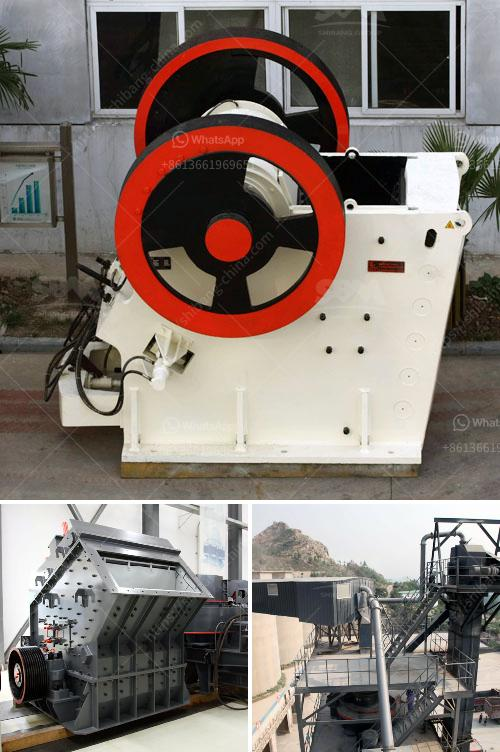

<h3>iron ore processing machine for sale</h3>
Iron ore is an essential component for the global iron and steel industries, and its demand has been steadily increasing over the years. With the rising demand, the machinery and equipment used in the mining and processing of iron ore must be efficient, reliable, and cost-effective.

Fortunately, advancements in technology have brought forth a range of iron ore processing machines that are capable of enhancing the extraction and beneficiation of this valuable mineral. These machines are designed to crush, grind, separate, and concentrate the iron ore to meet the required specifications for the production of steel.

One of the most commonly used machines in iron ore processing is a high-density magnetic separator. This specialized equipment utilizes magnetic forces to create a high-gradient magnetic field, ensuring that the iron ore particles are effectively separated from the gangue minerals. This results in a higher grade of iron concentrate being produced, which can then be utilized in steelmaking processes.

Another important machine in iron ore processing is the ball mill. With the ability to grind fine particles, the ball mill is widely used in various industries such as cement, silicate, new building materials, refractory materials, fertilizers, black and non-ferrous metal beneficiation, and glass ceramics. It plays a vital role in grinding crushed iron ore into powder, which is then further processed for various purposes.

Furthermore, there are also other machines like spiral classifiers, magnetic separators, flotation machines, and vibrating feeders that are used in various stages of the iron ore processing cycle. Each of these machines has a specific purpose and contributes to the overall efficiency and productivity of the iron ore processing plant.

For individuals or companies looking to invest in iron ore processing machinery, there are various suppliers and manufacturers around the world that offer a wide range of high-quality machines for sale. These machines are often customizable to meet specific project requirements and can be purchased at competitive prices.

In conclusion, the demand for iron ore in the global market continues to rise, necessitating the need for efficient and reliable iron ore processing machines. With advancements in technology, there are now a plethora of machines available for sale that can enhance the overall processing efficiency and productivity of iron ore. If you're in the market for iron ore processing equipment, it's crucial to research and find reputable suppliers that offer machines tailored to your specific needs.
<h3>Contact us</h3><ul><li><strong>Whatsapp:&nbsp;<a href="https://wa.me/8613661969651">+8613661969651</a></strong></li><li><a href="https://swt.shibang-china.com/?git&amp;zhl&amp;iron ore processing machine for sale"><strong>Online Service(chat now)</strong></a></li></ul><h3>Related</h3><ul><li><a href='how to make industrial talcum powder.md'>how to make industrial talcum powder</a></li><li><a href='concrete crushing plant in dubai.md'>concrete crushing plant in dubai</a></li><li><a href='3 mesh vibrating screen.md'>3 mesh vibrating screen</a></li><li><a href='business plan for clinker grinding plant.md'>business plan for clinker grinding plant</a></li><li><a href='cost of complete stone crushing plant in ghana.md'>cost of complete stone crushing plant in ghana</a></li></ul>