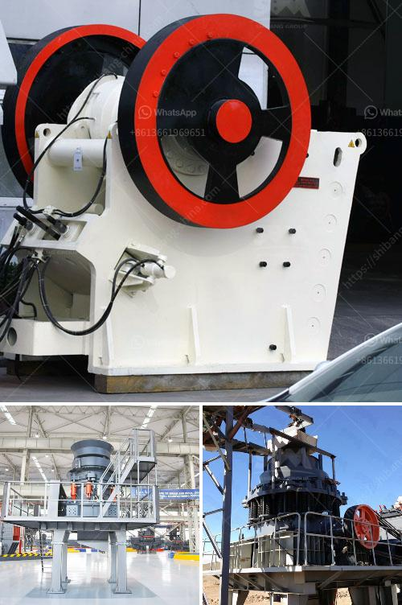

<h3>iron ore processing plant</h3>
Iron ore is a crucial raw material for the steel industry. Therefore, setting up an iron ore processing plant is a key step in mining iron ore and reducing its impurities for further downstream applications. Iron ore processing plants vary in size and complexity, but usually consist of several stages of crushing and grinding followed by classification.

Iron ore processing plant works the initial physical treating part. Usually, iron ore processing plants include iron ore crusher, grinding mill, beneficiation plants along with other assistant equipment. High productivity and low maintenance are a few of the traits that all of SBM's processing solutions have in prevalent and that make the day-to-day iron ore process a routine you’re thrilled to rely on. 

First, the primary crushing involves breaking down the huge iron ore lumps into small pieces that can be handled by conveyor belts. The primary crushing stage usually includes jaw crusher or gyratory crusher. The crushed ore is then transported to a cone crusher or impact crusher for secondary crushing.

Next, grinding is the crucial process in iron ore processing plants. The purpose is to reduce the ore to a size small enough to liberate and recover the valuable minerals. It is a large-scale process requiring high energy consumption. Typically, the final particle size is controlled by screening equipment and is balanced to ensure the optimal recovery of magnetic particles.

After grinding, the iron ore fines are separated with a magnetic separator to remove impurities, such as silica and alumina, as well as magnetic minerals. This is typically followed by a flotation process to separate the magnetic and non-magnetic particles. The flotation process uses chemicals to selectively separate and concentrate the desired minerals.

The final stage in iron ore processing is drying and stockpiling. Dryers are commonly used to remove excess moisture from the ore after the flotation process, resulting in a final product with a moisture content of around 9-11%. The dried ore is then stockpiled ready for transportation to a port, where it is shipped to steel-making plants.

Setting up an iron ore processing plant requires significant investment and expertise in various disciplines, including metallurgy, process engineering, electrical engineering, and automation. The plant must be designed to optimize the processing efficiency, reduce operating costs, and minimize environmental impact.

Iron ore processing plants play a crucial role in enriching iron ore. They produce a high-quality iron ore concentrate that contains valuable minerals, making it a critical component for steel production. The processing plants are essential for ensuring a reliable supply of iron ore to meet the growing demand.

In conclusion, iron ore processing plants are vital for the steel industry. They play a crucial role in the initial processing of raw iron ore and preparing it for further downstream applications. With the right design and technology, these plants can efficiently process iron ore and produce high-quality iron ore concentrate, contributing to the overall supply chain of the steel industry.
<h3>Contact us</h3><ul><li><strong>Whatsapp:&nbsp;<a href="https://wa.me/8613661969651">+8613661969651</a></strong></li><li><a href="https://swt.shibang-china.com/?git&amp;zhl&amp;iron ore processing plant"><strong>Online Service(chat now)</strong></a></li></ul><h3>Related</h3><ul><li><a href='ethiopia stone crushing plant.md'>ethiopia stone crushing plant</a></li><li><a href='machines used for coal mining.md'>machines used for coal mining</a></li><li><a href='rock crusher in africa.md'>rock crusher in africa</a></li><li><a href='distributor philippines test sieve retsch.md'>distributor philippines test sieve retsch</a></li><li><a href='jaw crusher for sale in malaysia.md'>jaw crusher for sale in malaysia</a></li></ul>