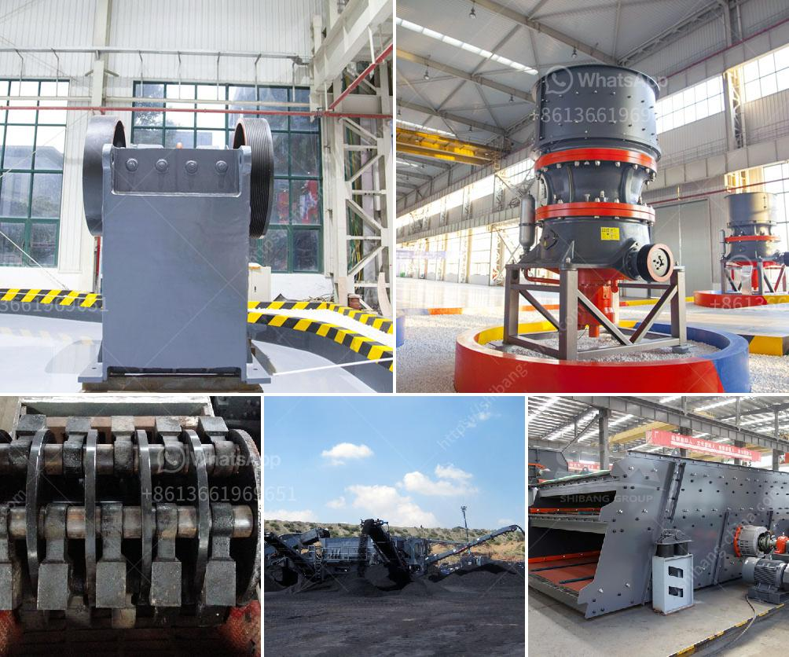

<h3>iron processing machine price</h3>
Iron processing machines play a vital role in various industries, including manufacturing, construction, and engineering. These machines are designed to efficiently process iron and other related materials into usable products. However, one crucial aspect that influences the decision to invest in such machinery is the price. The cost of iron processing machines can vary significantly based on several factors. In this article, we will explore these factors and provide insights into the price range of these machines.

One of the primary determinants of the price of iron processing machines is their size and capacity. Larger machines that can process a higher volume of iron in a shorter time tend to have higher price tags. This is because they require more robust materials, intricate designs, and advanced technologies to meet the demanding requirements. Additionally, larger machines often consume more energy and require specialized installation and maintenance, which adds to their overall price.

The complexity of the machine also affects its price. Iron processing machines with advanced features and cutting-edge technologies tend to be more expensive. These machines can offer enhanced efficiency, precision, and automation, resulting in higher production rates and improved quality. Manufacturers invest heavily in research and development to design and incorporate these advanced features, leading to higher production costs. Therefore, customers must assess their specific requirements and consider the complexities they truly need in an iron processing machine before making a purchase decision.

The brand and reputation of the manufacturer can also impact the price of iron processing machines. Well-established and reputable brands often have higher price points due to their long-standing history of delivering quality products and reliable customer support. These brands invest significantly in product testing, certifications, and after-sales services to ensure customer satisfaction. While investing in a reputable brand might come at a premium, it often guarantees durability, reliability, and efficient service throughout the machine's lifecycle.

Market conditions and demand-supply dynamics influence the price of iron processing machines as well. When there is high demand and limited supply, prices tend to rise. Conversely, during periods of low demand and oversupply, manufacturers often compete by reducing prices to attract customers. Additionally, external factors such as economic conditions, exchange rates, and raw material costs can also impact the final price. It is crucial for potential buyers to monitor market trends and availabilities to make informed decisions.

Lastly, the level of customization required by the customer can affect the price of iron processing machines. Some customers may have specific requirements or unique industry needs that necessitate customization of the machine. Customization involves additional engineering work, modifications to the design, and specialized components, which can drive up the overall cost. Therefore, it is important for customers to communicate their customization needs clearly to the manufacturer and understand the associated costs involved.

In conclusion, the price of iron processing machines is influenced by several key factors. Machine size and capacity, complexity, brand reputation, market dynamics, and customization requirements can all impact the final price tag. It is essential for customers to thoroughly assess their needs, consider the long-term benefits and costs, and engage with reliable manufacturers to make an informed investment decision. By carefully evaluating these factors, businesses can acquire iron processing machines that provide value for money and contribute to their operational success.
<h3>Contact us</h3><ul><li><strong>Whatsapp:&nbsp;<a href="https://wa.me/8613661969651">+8613661969651</a></strong></li><li><a href="https://swt.shibang-china.com/?git&amp;zhl&amp;iron processing machine price"><strong>Online Service(chat now)</strong></a></li></ul><h3>Related</h3><ul><li><a href='hammer mill in nigeria.md'>hammer mill in nigeria</a></li><li><a href='simple stone crushing machine price in kenya.md'>simple stone crushing machine price in kenya</a></li><li><a href='grinding mill machine gebraucht.md'>grinding mill machine gebraucht</a></li><li><a href='stone crusher in uganda.md'>stone crusher in uganda</a></li><li><a href='hammer mill and ball mill.md'>hammer mill and ball mill</a></li></ul>