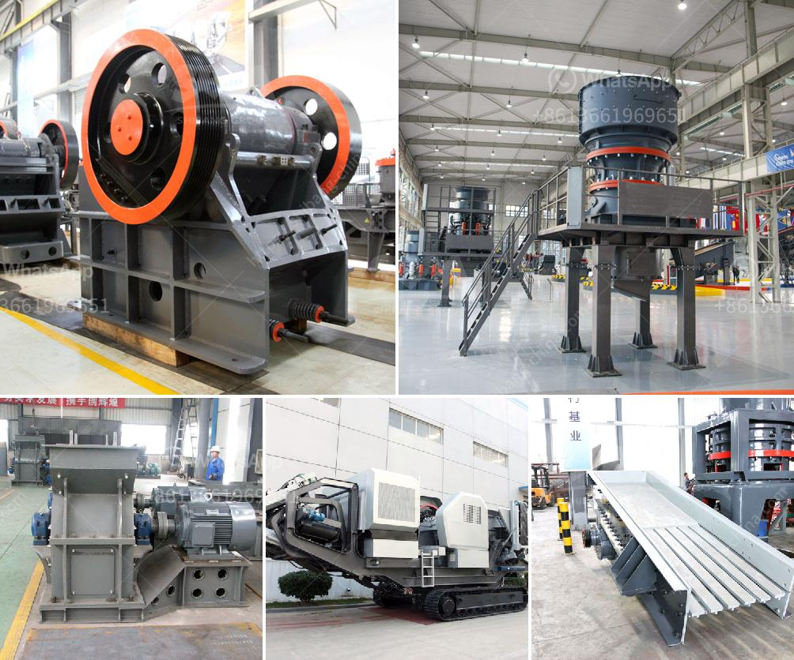

<h3>iron slag buyers in punjab india</h3>
Iron slag is a byproduct of iron and steel production and is commonly found in large quantities in Punjab, India. With its rich industrial heritage, Punjab generates a significant amount of iron slag every year. While traditionally considered waste, iron slag has gained attention in recent years due to its potential uses in various industries. This has led to an increase in iron slag buyers in Punjab, India.

One of the primary reasons for the growing interest in iron slag is its utilization as a raw material in construction and road building projects. Iron slag is known for its cementitious properties, which make it an ideal substitute for cement in the production of concrete. It enhances the durability and strength of the concrete while reducing its cost. As a result, many construction companies in Punjab have started using iron slag as an eco-friendly alternative to cement.

Furthermore, iron slag is also being used as a base material for road construction. Its high resistance to wear and tear, coupled with its binding properties, make it an excellent choice for road building projects. By substituting traditional aggregates with iron slag, the roads become more durable and require less maintenance, resulting in long-term cost savings for the government and private contractors.

Due to the increased demand for iron slag, there has been a rise in the number of buyers in Punjab. These buyers, ranging from small-scale traders to large industrial firms, play a crucial role in the iron slag market. They are responsible for procuring iron slag from various sources such as steel plants, foundries, and recycling centers.

To attract iron slag buyers, sellers in Punjab have adopted modern marketing techniques. They often participate in trade fairs and exhibitions, where they showcase the quality and potential uses of their iron slag. Additionally, online platforms have become popular for both buyers and sellers to connect and negotiate deals. This ease of access to information and business opportunities has contributed to the growth of the iron slag market in Punjab.

However, challenges still exist in the iron slag industry. One such challenge is the variability in the quality of the iron slag produced by different sources. This inconsistency can affect its usability in construction and road building projects. To address this issue, some buyers in Punjab have established quality control measures, ensuring that only high-quality iron slag is procured.

Another challenge is the transportation and logistics involved in the iron slag trade. Iron slag is heavy and bulky, making it expensive to transport over long distances. To mitigate this challenge, iron slag buyers often prefer to source slag from nearby regions, reducing transportation costs and environmental impact.

In conclusion, the iron slag industry in Punjab, India, is witnessing a steady growth due to its potential uses in construction and road building projects. With the rise in iron slag buyers and advancements in marketing techniques, the industry is becoming more organized and efficient. However, challenges related to quality control and transportation still persist. Nonetheless, as the demand for eco-friendly construction materials continues to rise, iron slag is likely to play an important role in Punjab's construction and infrastructure development.
<h3>Contact us</h3><ul><li><strong>Whatsapp:&nbsp;<a href="https://wa.me/8613661969651">+8613661969651</a></strong></li><li><a href="https://swt.shibang-china.com/?git&amp;zhl&amp;iron slag buyers in punjab india"><strong>Online Service(chat now)</strong></a></li></ul><h3>Related</h3><ul><li><a href='jaw crusher 200 tonnes per hour.md'>jaw crusher 200 tonnes per hour</a></li><li><a href='rock crusher machine equipment in canada.md'>rock crusher machine equipment in canada</a></li><li><a href='gypsum crusher manufacturing in odisha.md'>gypsum crusher manufacturing in odisha</a></li><li><a href='crusher and screening plant.md'>crusher and screening plant</a></li><li><a href='germany stone crusher machine factories.md'>germany stone crusher machine factories</a></li></ul>