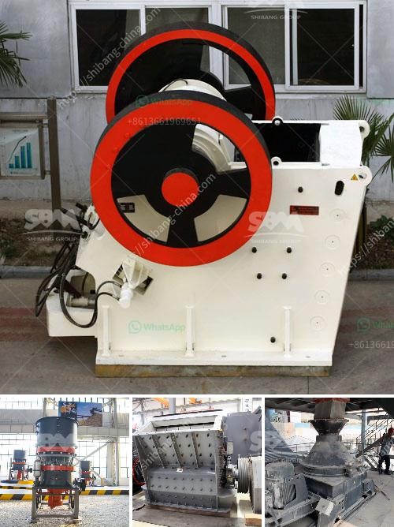

<h3>italia gypsum block making mechines</h3>
The construction industry has always been at the center of technological advancements, with the aim of enhancing efficiency, productivity, and cost-effectiveness. Advancements in building materials and machinery have played a crucial role in meeting these objectives.

One such breakthrough in the construction industry is the Italia gypsum block making machines. These machines have revolutionized the way gypsum blocks are manufactured, bringing numerous benefits to builders, designers, and project owners alike. Let's delve deeper into what makes these machines so extraordinary.

First and foremost, Italia gypsum block making machines allow for the production of high-quality gypsum blocks. Gypsum blocks are lightweight, fire-resistant, and possess excellent insulation properties. Moreover, they are easy to handle, reducing labor costs and increasing overall productivity.

These machines ensure precise and uniform production, leading to consistent block sizes and shapes. This consistency is particularly important when constructing walls, as it guarantees a seamless finish, without any gaps or irregularities. The quality of gypsum blocks produced by Italia machines meets international standards, making them highly sought-after in the global market.

Furthermore, the speed of production is significantly increased with the use of Italia gypsum block making machines. These machines have automated processes, allowing for continuous production with minimal downtime. This enables larger quantities of gypsum blocks to be manufactured within a shorter period, which is crucial for meeting tight project deadlines.

The Italia machines also offer versatility in design options. They have the capability to produce gypsum blocks with various patterns, textures, and finishes. This opens up a world of possibilities for architects and designers, who can now create aesthetically stunning walls and structures using gypsum blocks. The ability to customize block designs to suit specific project requirements is a significant advantage offered by Italia machines.

In addition to their quality and design capabilities, Italia gypsum block making machines are also environmentally friendly. The production process generates minimal waste, with most of the by-products being recyclable. Gypsum blocks themselves are sustainable construction materials, as they are made from natural gypsum, a readily available resource.

Italia machines are known for their durability and reliability. With proper maintenance and care, these machines can withstand years of operation, minimizing downtime and repair costs. This makes them a cost-effective investment for construction companies, as they offer long-term savings and increased profitability.

It is worth mentioning that Italia gypsum block making machines are backed by a strong after-sales support network. This ensures that buyers receive timely assistance and maintenance services, guaranteeing uninterrupted and efficient production.

In conclusion, Italia gypsum block making machines have undoubtedly transformed the construction industry. Their ability to produce high-quality, customizable, cost-effective, and environmentally friendly gypsum blocks has made them indispensable for builders and designers worldwide. With their continued advancements and innovation, Italia machines are set to shape the future of construction, providing sustainable and efficient solutions for the built environment.
<h3>Contact us</h3><ul><li><strong>Whatsapp:&nbsp;<a href="https://wa.me/8613661969651">+8613661969651</a></strong></li><li><a href="https://swt.shibang-china.com/?git&amp;zhl&amp;italia gypsum block making mechines"><strong>Online Service(chat now)</strong></a></li></ul><h3>Related</h3><ul><li><a href='vibrating screens 250tph.md'>vibrating screens 250tph</a></li><li><a href='mtm 160 trapezium mill shanghai.md'>mtm 160 trapezium mill shanghai</a></li><li><a href='sand washing machines for crusher nepal.md'>sand washing machines for crusher nepal</a></li><li><a href='sell crusher of jaw in peru.md'>sell crusher of jaw in peru</a></li><li><a href='crusher for dolomite.md'>crusher for dolomite</a></li></ul>