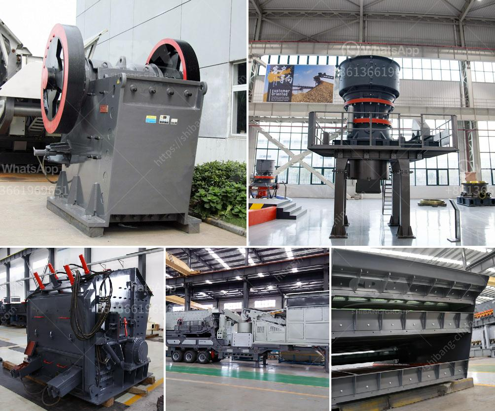

<h3>items for conveyor belts</h3>
Conveyor belts play a crucial role in numerous industries, facilitating the smooth movement of items from one point to another. They are used in sectors ranging from manufacturing and logistics to agriculture and mining. To ensure efficient and reliable conveyor belt operation, various essential items can be incorporated into the system. This article will explore some key items that enhance conveyor belt performance and productivity.

Firstly, belt cleaners are fundamental components of conveyor systems. These devices remove material residue and debris from the conveyor belt's surface, preventing it from sticking and causing damage or disruption. Belt cleaners are available in different types, such as scrapers, brushes, and air knives, designed to suit various industries and belt materials. Regular maintenance and replacing worn-out cleaners are essential to maintain belt longevity and minimize downtime.

Secondly, conveyor belt tracking systems are crucial in maintaining proper belt alignment. Belts can easily deviate from their intended path due to factors such as heavy loads, uneven distribution, or misalignment. Tracking systems, including sensors and guiding devices, help ensure that conveyor belts stay on track. These systems detect any misalignment and automatically adjust the belt position to prevent damage and minimize the need for manual intervention.

Additionally, conveyor belt idlers are essential elements that support and guide the belt along its path. Idlers consist of roller assemblies mounted on frames and are strategically placed to decrease friction and support the belt's weight. Well-designed and properly maintained idlers are crucial to reducing the risk of belt sagging, misalignment, and premature wear. These items are available in various designs and materials, such as steel, rubber, or plastic, to accommodate diverse applications.

Furthermore, belt fasteners are critical for joining conveyor belts and ensuring their strength and durability. These mechanical connectors are used when new belts are installed or when repairing damaged sections. Belt fasteners are available in different shapes and sizes, such as staples, hinges, or lace hooks, to suit various belt widths and thicknesses. Proper installation of belt fasteners ensures a secure and reliable connection, preventing belt separations and minimizing costly downtime for repair or replacement.

Another important item for conveyor belts is the drive system. Drive systems consist of motors, gearboxes, and couplings that provide the required power to move the belt efficiently. Choosing the proper drive system based on factors like load capacity, operating conditions, and energy efficiency is crucial for optimal conveyor belt performance. Regular maintenance and monitoring will help identify any issues with the drive system and prevent potential breakdowns.

Lastly, safety components cannot be overlooked when discussing items for conveyor belts. Safety measures, such as emergency stop devices, safety guards, and sensors, are essential to protect workers and prevent accidents. Operators should be well-trained in safety procedures and have access to safety equipment like safety switches, protective barriers, and warning signs. Regular inspections and risk assessments are critical to identify potential hazards and address them promptly.

In conclusion, conveyor belts are vital in various industries, and integrating the right items into the system ensures optimal performance and longevity. Items like belt cleaners, tracking systems, idlers, fasteners, drive systems, and safety components play crucial roles in enhancing productivity and minimizing downtime. Proper maintenance, inspections, and addressing issues promptly are key to maximizing conveyor belt efficiency and reliability.
<h3>Contact us</h3><ul><li><strong>Whatsapp:&nbsp;<a href="https://wa.me/8613661969651">+8613661969651</a></strong></li><li><a href="https://swt.shibang-china.com/?git&amp;zhl&amp;items for conveyor belts"><strong>Online Service(chat now)</strong></a></li></ul><h3>Related</h3><ul><li><a href='manufacturers of stone crushers in usa.md'>manufacturers of stone crushers in usa</a></li><li><a href='lafarge evander quartz crushers.md'>lafarge evander quartz crushers</a></li><li><a href='slag crusher plant.md'>slag crusher plant</a></li><li><a href='vertical mill china.md'>vertical mill china</a></li><li><a href='vibrating screens 250tph.md'>vibrating screens 250tph</a></li></ul>