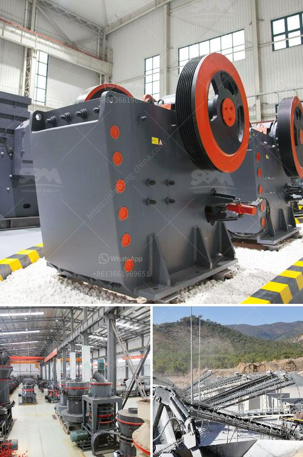

<h3>japan of mobile crushing plant</h3>
Japan is known for its technological advancements and its ability to transform industries with innovative solutions. One such industry that has seen a significant change is the construction industry, thanks to the introduction of mobile crushing plants.

Mobile crushing plants are a game-changer in the construction industry. These technologically advanced systems are used to crush concrete, rocks, and other materials to produce aggregate, a crucial component in the construction of roads, buildings, and bridges. The mobile nature of these plants allows for easy transportation from one site to another, making them highly sought after in Japan.

One of the key advantages of mobile crushing plants in Japan is their ability to operate in a variety of terrains. Japan's geography is diverse, with mountains, valleys, and coastal regions. Traditional crushing plants were limited in their ability to be transported and set up in these challenging terrains. However, mobile crushing plants can be easily transported to such areas, allowing for convenient operation in remote locations.

Another advantage of mobile crushing plants is their ability to be easily set up and dismantled. In Japan, where construction projects are often time-bound, efficiency and speed are crucial. Mobile crushing plants can be quickly assembled on-site, significantly reducing the time and labor required for installation. This quick setup time also allows for quicker project completion, leading to increased productivity and cost savings.

Moreover, mobile crushing plants offer flexibility in terms of production capacity. These plants can be customized to meet specific project requirements, allowing contractors to produce aggregate in desired quantities. In Japan, where construction projects vary in scale and scope, this flexibility is highly valuable.

The introduction of mobile crushing plants in Japan has also positively impacted the environment. Conventional crushing methods often result in the generation of excessive dust and noise. Mobile crushing plants, on the other hand, are specially designed to minimize dust generation and noise pollution. Additionally, the use of electric-powered crushers in these plants reduces the emission of harmful pollutants, contributing to a greener environment.

Japanese manufacturers have been at the forefront of developing and producing mobile crushing plants. Their expertise and adherence to quality standards have made Japan a leader in this industry. Plants manufactured in Japan are known for their durability, reliability, and low maintenance requirements. This has significantly contributed to their popularity among contractors in Japan.

In conclusion, mobile crushing plants have revolutionized the construction industry in Japan. Their ability to operate in challenging terrains, quick setup time, flexibility, and environmental benefits make them a preferred choice for contractors. Japanese manufacturers have played a key role in developing these technologically advanced plants, further cementing Japan's reputation as a global leader in innovation and technology. With the continued advancements in this field, mobile crushing plants are expected to play an even bigger role in shaping the future of the construction industry in Japan.
<h3>Contact us</h3><ul><li><strong>Whatsapp:&nbsp;<a href="https://wa.me/8613661969651">+8613661969651</a></strong></li><li><a href="https://swt.shibang-china.com/?git&amp;zhl&amp;japan of mobile crushing plant"><strong>Online Service(chat now)</strong></a></li></ul><h3>Related</h3><ul><li><a href='grinding mill manufacturer in italy.md'>grinding mill manufacturer in italy</a></li><li><a href='principle of impact crusher.md'>principle of impact crusher</a></li><li><a href='vsi crusher machine.md'>vsi crusher machine</a></li><li><a href='mini crushing plant for sale.md'>mini crushing plant for sale</a></li><li><a href='making of calcium carbonate calcite powder.md'>making of calcium carbonate calcite powder</a></li></ul>