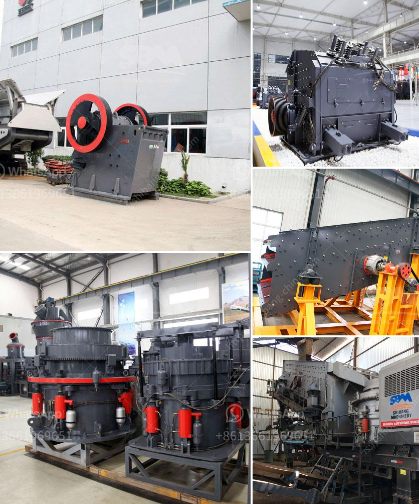

<h3>jaw crusher 200 tonnes per hour</h3>
The jaw crusher is an innovative device that is so important to the construction industry. It is this device that enables large boulders to be broken down into usable aggregate material. There are different types of jaw crushers, as well as crushers in general, that all play a role in this process. Each stage of the breaking down of stone or aggregate material into smaller pieces is achieved with the help of a jaw crusher. Therefore, this machine is essential when it comes to ensuring the productivity and efficiency of a construction site.

One of the key features that makes the jaw crusher really stand out is its ability to process huge amounts of material in an efficient manner. This makes it the ideal equipment for quarrying and mining operations, where large amounts of stone or ore need to be processed.

The jaw crusher design includes a set of two vertical jaws—a fixed (stationary) jaw and a swing (reciprocating) jaw. The swing jaw moves back and forth by a cam or pitman mechanism, acting like a nutcracker or a class II lever. The gap or space (cavity) between the two jaws becomes narrower as the material is crushed and moves down through the chamber.

One specific type of jaw crusher, the Blake crusher, was patented by Eli Whitney Blake in 1858. The Blake type jaw crusher has a fixed feed area and a variable discharge area. Blake crushers are of two types: single toggle and double toggle jaw crushers. In the single toggle jaw crushers, the swing jaw is suspended on the eccentric shaft, which leads to a much more compact design compared to double toggle jaw crushers.

The jaw crusher 200 tonnes per hour is one of the bestselling models from the range of Core products. The sturdy design, advanced technology and efficiency make it a must-have for any construction site. This highly productive yet cost-effective equipment, combines high crushing capacity, versatility, and precision engineering, resulting in top-notch performance.

Imagine having the ability to produce different sizes of aggregates quickly and efficiently without compromising on quality. With the jaw crusher 200 tonnes per hour, you can have the convenience and efficiency of a crusher that can easily handle multiple tasks such as crushing, recycling, quarrying, or mining operations. In fact, it is an essential tool for every construction site.

The jaw crusher 200 tonnes per hour offers high capacity crushing capabilities in an easily transported compact unit. This makes it perfect for the quarrying or mining industries, where space is often limited. Customizing the jaw crusher for your specific needs will help you get the desired output while maximizing efficiency.

In conclusion, the jaw crusher 200 tonnes per hour presents its own set of unique challenges in the construction industry. Incorporating high-quality design with innovative features such as the jaw crusher ensures the best possible performance, whether in recycling, quarrying, or mining operations. It is an essential tool for every construction site, offering unmatched productivity and efficiency. Invest in the jaw crusher 200 tonnes per hour and experience the benefits firsthand.
<h3>Contact us</h3><ul><li><strong>Whatsapp:&nbsp;<a href="https://wa.me/8613661969651">+8613661969651</a></strong></li><li><a href="https://swt.shibang-china.com/?git&amp;zhl&amp;jaw crusher 200 tonnes per hour"><strong>Online Service(chat now)</strong></a></li></ul><h3>Related</h3><ul><li><a href='stone crusher plant price list.md'>stone crusher plant price list</a></li><li><a href='beneficiation plant for feldspar japan.md'>beneficiation plant for feldspar japan</a></li><li><a href='components of mobile coal processing plant.md'>components of mobile coal processing plant</a></li><li><a href='cement plant in riyadh.md'>cement plant in riyadh</a></li><li><a href='gypsum recycling machines for sale.md'>gypsum recycling machines for sale</a></li></ul>