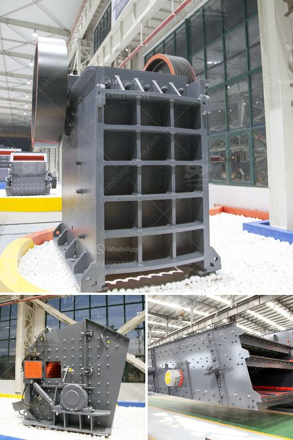

<h3>jaw crusher 24x36</h3>
The jaw crusher 24x36 is a versatile equipment that is widely used in various crushing applications. It is designed for crushing rocks, ores, hard materials, and recyclables. The crusher is capable of handling different types of materials efficiently, reducing them in size so that further processing can be done. 

One of the key features of the jaw crusher 24x36 is its large feed opening size. This allows the crusher to accept larger feed materials, increasing its capacity and productivity. The wide feed opening also makes it easier to feed the crusher with various types of materials, minimizing the need for pre-screening or sorting.

The jaw crusher 24x36 is equipped with a powerful and fuel-efficient engine that delivers high performance. The engine ensures that the crusher operates smoothly and efficiently, minimizing downtime and maximizing productivity. It also reduces fuel consumption, making it a cost-effective choice for crushing operations.

The jaw crusher 24x36 is designed for easy maintenance, with its user-friendly features. The crusher is equipped with a hydraulic system that enables quick and easy adjustments to the crusher settings, ensuring optimal performance and productivity. The hydraulic system also allows for easy access to the crusher's interior, making maintenance tasks, such as replacing wear parts, quick and convenient.

Safety is a top priority in the design of the jaw crusher 24x36. The crusher is equipped with safety features, such as a protective guard around the flywheel and pulley, ensuring the safety of the operator during operation. The crusher is also equipped with integrated safety devices, such as the automatic overload protection system, which protects the crusher from damage in case of overload or tramp iron.

In conclusion, the jaw crusher 24x36 is a reliable and efficient crushing equipment that offers high performance, versatility, and ease of maintenance. Its large feed opening, powerful engine, and user-friendly features make it a preferred choice for various crushing applications. Whether for mining, construction, or recycling, the jaw crusher 24x36 proves to be a valuable asset in any crushing operation.
<h3>Contact us</h3><ul><li><strong>Whatsapp:&nbsp;<a href="https://wa.me/8613661969651">+8613661969651</a></strong></li><li><a href="https://swt.shibang-china.com/?git&amp;zhl&amp;jaw crusher 24x36"><strong>Online Service(chat now)</strong></a></li></ul><h3>Related</h3><ul><li><a href='stone crushers kenya.md'>stone crushers kenya</a></li><li><a href='sand sieve machine philippines.md'>sand sieve machine philippines</a></li><li><a href='limestone screen high frequency used.md'>limestone screen high frequency used</a></li><li><a href='crushing pf impact crusher.md'>crushing pf impact crusher</a></li><li><a href='stone crusher sample business plan.md'>stone crusher sample business plan</a></li></ul>