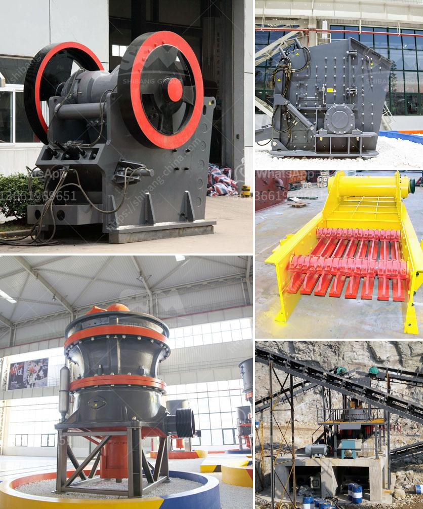

<h3>jaw crusher animation</h3>
Jaw crusher animation shows just how jaw crusher equipment works. is one line of crushing products that is offered by Kemper Equipment, which provides quarry equipment and parts to the Mid-Atlantic. Find out more about the rock crushers that Kemper carries at https://www.kemperequipment.com/full-line-product-guide/crushers/ or call them at (610) 273-2066 today.

Are you looking for a jaw crusher? If so, you’re in the right place! Kemper Equipment is a well-known supplier of rock crushing equipment, and more, with locations in Pennsylvania and New Jersey. We’re happy to help you find exactly what you need.

Now, let’s take a closer look at this essential piece of equipment: the jaw crusher, and how it works.

As we touched on above, different jaw crusher designs will operate slightly differently, but how they work is similar across the board. All jaw crushers reduce large sized rocks, ore, or other material by a compression action. A fixed jaw, mounted in a V-shaped alignment, is the stationary breaking surface, while a movable, “swing” jaw exerts force on the feed material by pushing it against the stationary plate.

The space at the base of the V-aligned jaw plates is the crusher product size gap, or the size of the crushed product from the jaw crusher. The rock remains in the jaws until it is small enough to pass through the gap. Jaw crushers can process shot rock and gravel. They can work with a variety of different materials, including construction aggregates and sand.

The movement in jaw crushers is generated through an eccentric shaft that moves the jaw swing. The flywheel, connected to the eccentric shaft, “wracks up” energy as it turns. This energy then transfers into crushing power, crushing the feed material against the fixed jaw plates. When the material is small enough to pass through the gap between the two jaws, it is discharged as the crushed product.

Jaw crusher animations are usually made between fixed jaw plate and movable jaw plate. Usually, these are fitted with turning half-nodes that are attached to the outer side of the flywheel. This type of jaw crusher can be used to crush asphalt, concrete, and limestone materials, as well as other less abrasive materials.

- Double Toggle – Also called Blake jaw crusher, a double toggle jaw crusher does a good job of crushing extremely hard materials because of its heavy-duty design.

- Single Toggle – Single toggle jaw crushers have less moving parts, which means less maintenance is needed and they also have a lower energy consumption rate.

- Overhead Eccentric – This type has a higher crushing capability compared to double toggle models because it has fewer moving parts. It also creates more stable, controlled jaw movement, which results in superior crushing performance.

Jaw crushers are essential pieces of equipment in the construction and mining industries. They can be used in various applications, including rock quarries, recycling plants, and ore reduction operations. Jaw crushers have been around for nearly 200 years and are one of the most “historic” crusher types. Because of this, they’re simply known as “rock crushers.”

If you’re looking to purchase a jaw crusher or one of our other crushing equipment options, give Kemper Equipment a call. We’ll be happy to help you find the best jaw crusher for your specific needs and applications.
<h3>Contact us</h3><ul><li><strong>Whatsapp:&nbsp;<a href="https://wa.me/8613661969651">+8613661969651</a></strong></li><li><a href="https://swt.shibang-china.com/?git&amp;zhl&amp;jaw crusher animation"><strong>Online Service(chat now)</strong></a></li></ul><h3>Related</h3><ul><li><a href='bentonite grinding machines price.md'>bentonite grinding machines price</a></li><li><a href='qurry crusher plant capacity.md'>qurry crusher plant capacity</a></li><li><a href='rock grinding equipment for sale in texas.md'>rock grinding equipment for sale in texas</a></li><li><a href='stone crusher accounting in tally.md'>stone crusher accounting in tally</a></li><li><a href='pulverizer crusher manufacturers in pune.md'>pulverizer crusher manufacturers in pune</a></li></ul>