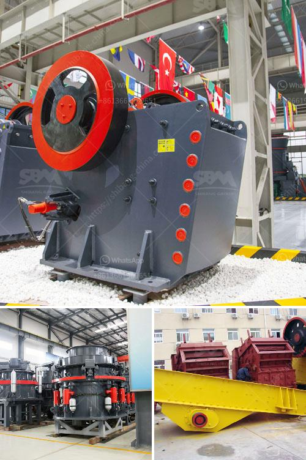

<h3>jaw crusher ethiopia</h3>
Ethiopia is one of the countries in the world that is driving strides in mining and construction. The country has been a significant producer of various minerals such as platinum, tantalite, copper, potash, and gold. These minerals have provided opportunities for economic growth and development. One of the critical machines that have been instrumental in the mining industry in Ethiopia is the jaw crusher.

Jaw crushers are designed to break down large rocks into smaller stones and gravel. They have a set of vertical jaws, one fixed and the other moved back and forth, making them ideal for primary and secondary crushing operations. The jaw crusher in Ethiopia works systematically and efficiently to ensure the best possible fragmentation of the material.

The primary jaw crusher is typically of the square opening design, and the secondary jaw crusher is of the rectangular opening design. Jaw crusher reduces the size of the rocks or ore by placing the rock into compression. The jaw crusher machine adopts a single sleeve type with an asymmetrical deep crushing chamber, which is easy to adjust and easier to implement in the crushing process.

The Ethiopian jaw crusher market is booming. There are many foreign investors and mining companies expanding their business in Ethiopia. To help the Ethiopian government achieve its growth targets, they have been investing heavily in infrastructure and mineral exploration projects. Jaw crushers play a vital role in these projects by providing the initial crushing of the aggregates needed for construction.

Ethiopian road construction projects improve the country's road infrastructure, making it an attractive investment destination for foreign companies. Jaw crushers are the primary crusher in the road construction projects, and they play a crucial role in the material handling aspect of these projects.

Apart from road construction, jaw crushers also find applications in the mining industry. Mining operations in Ethiopia are becoming more sophisticated and utilizing advanced machinery to extract minerals. The jaw crusher is one of the crucial machines, as it is the first equipment in the mineral extraction process.

In recent years, Ethiopia has experienced a significant growth in its population, resulting in an increased demand for residential and commercial buildings. The construction sector has been booming, creating opportunities for construction companies as well as equipment suppliers. Jaw crushers have become an essential tool in this sector, as they help in breaking down rocks and stones into smaller sizes required for construction purposes.

The jaw crusher in Ethiopia is also essential for recycling construction waste effectively. The waste concrete and tiles are crushed into small particles and recycled for new projects. Not only does this promote environmental sustainability, but it also helps in saving costs and reducing the demand for raw materials.

Overall, the jaw crusher in Ethiopia has been a game-changer in the mining and construction industry. It has brought immense benefits to the country and positively impacted its economy. With the continuous growth and expansion of the sector, the jaw crusher will remain an integral part of Ethiopia’s mining and construction journey for years to come.
<h3>Contact us</h3><ul><li><strong>Whatsapp:&nbsp;<a href="https://wa.me/8613661969651">+8613661969651</a></strong></li><li><a href="https://swt.shibang-china.com/?git&amp;zhl&amp;jaw crusher ethiopia"><strong>Online Service(chat now)</strong></a></li></ul><h3>Related</h3><ul><li><a href='conveyor belts in the construction.md'>conveyor belts in the construction</a></li><li><a href='crusher hpt cone crusher price.md'>crusher hpt cone crusher price</a></li><li><a href='major advantage of impact cone crusher.md'>major advantage of impact cone crusher</a></li><li><a href='hammer mill south africa.md'>hammer mill south africa</a></li><li><a href='graphite manufacturing plant.md'>graphite manufacturing plant</a></li></ul>