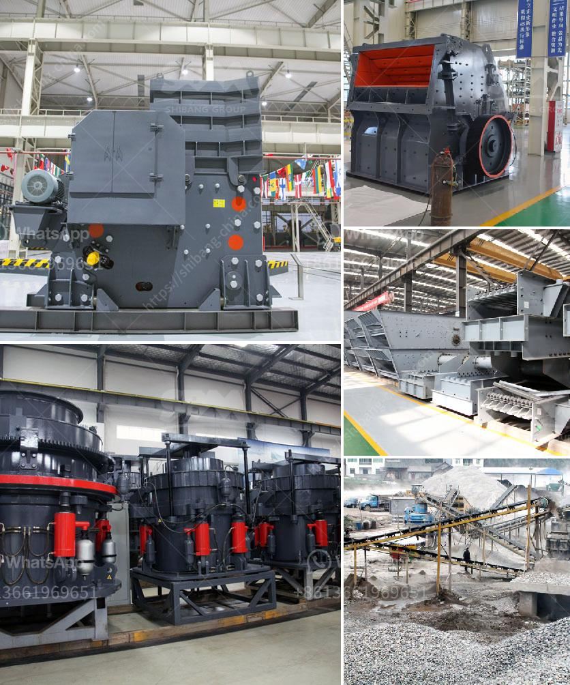

<h3>jaw crusher for hire south africa for limestone</h3>
Jaw crusher is one of the most popular breaking equipment in the world wide range of applications, including limestone, construction waste, metals and non-metallic ore, with a wide range of materials and a wide range of crushing capacity. It is often used for primary crushing of various hard and abrasive materials.

The jaw crusher is a highly efficient crushing equipment. It consists of two jaw plates, one fixed and one movable. The movable jaw plate pivots at the top and can be moved by eccentric shaft. When the movable jaw plate is moving, the angle between the fixed jaw plate and the movable jaw plate becomes larger, and the material can be crushed, strained, or even crushed, split, thus achieving the purpose of crushing.

Hiring a jaw crusher in South Africa is a great idea, not only because of the availability, but also for the convenience of itinerant work. If you are unsure about which model or brand you need, we can help you with that as well. We have experience with various types of stone crushers.

Feeding size for jaw crusher can vary from around 125 mm to 700 mm depending on the model. We can provide a customised solution to fit your needs and budget. Our wide range of jaw crushers is ready to be supplied to clients across South Africa.

Our experienced team of consultants will evaluate your unique requirements and recommend the best solution for your needs. Whether you are in the construction industry, mining industry, or any other industry that requires the crushing of limestone or other stone materials, our jaw crushers are the perfect choice.

The advantages of jaw crushers are high productivity, simple structure, adjustable product size, easy to operate and maintain. Its flexible configuration, crushing ratio, uniform discharge size and long service life make the jaw crusher a popular choice among contractors.

In addition, we also provide jaw crusher for hire South Africa to meet the needs of miners, quarries, and other projects. Some of our clients also ask for 3 stage portable mobile crushers of 200 TPH and above which consists of jaw, cone and HSI along with other accessories. We committed to assist such clients by sourcing and supplying then with used and fully reconditioned / refurbished 2 and 3 stage mobile crushers.

Jaw crusher for hire South Africa for limestone, jaw crusher liner design, jaw crusher for hire South Africa would allow you to enjoy reduced downtime and reliability, thus ensuring maximum productivity. Galvanizing the global export market for Jaw crushers, we have efficient logistics teams worldwide with multiple shipping options to meet our client’s demands in multiple locations.

In conclusion, there are many reputable jaw crusher suppliers in South Africa which makes it a difficult decision to choose the right one. So, visit us at Crusher Forever and let us assist you in selecting the best equipment for your needs. Our experienced team is ready to serve you with excellence and dedication.
<h3>Contact us</h3><ul><li><strong>Whatsapp:&nbsp;<a href="https://wa.me/8613661969651">+8613661969651</a></strong></li><li><a href="https://swt.shibang-china.com/?git&amp;zhl&amp;jaw crusher for hire south africa for limestone"><strong>Online Service(chat now)</strong></a></li></ul><h3>Related</h3><ul><li><a href='gold stamp mill for sale zim price.md'>gold stamp mill for sale zim price</a></li><li><a href='marble stone powder manufacturer in pakistan.md'>marble stone powder manufacturer in pakistan</a></li><li><a href='portable diamond washing plant.md'>portable diamond washing plant</a></li><li><a href='granite crushers for sale.md'>granite crushers for sale</a></li><li><a href='gold mining equipments manufacturers in denmark.md'>gold mining equipments manufacturers in denmark</a></li></ul>