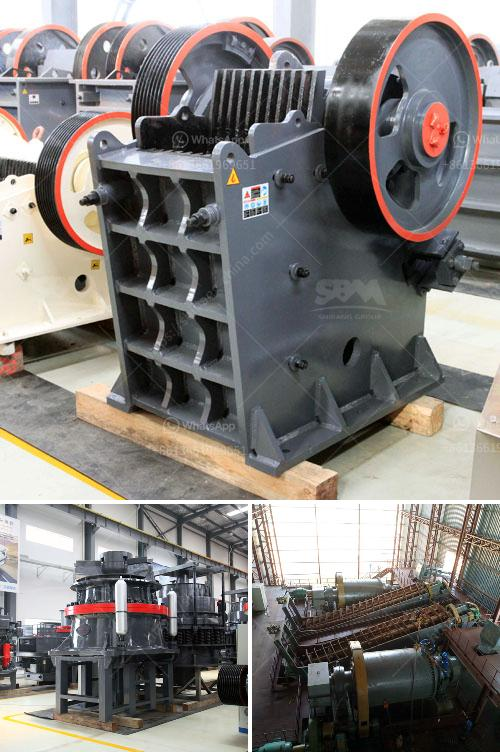

<h3>jaw crusher for sale china</h3>
When it comes to finding jaw crusher for sale China, people often overlook the quality and durability that they offer. However, it is important to remember that a jaw crusher is an essential piece of equipment in many industries and should not be overlooked.

China is known for its manufacturing capabilities and its ability to produce high-quality machinery at affordable prices. The same applies to jaw crushers. China has numerous manufacturers that produce jaw crushers of all sizes and specifications. Whether you need a small jaw crusher for a minor project or a large jaw crusher for heavy-duty applications, you can find it in China.

One of the advantages of buying a jaw crusher from China is the cost. Chinese manufacturers offer competitive prices while maintaining high standards of quality. They are able to achieve this by taking advantage of the country's low labor costs and efficient production processes. Therefore, you can get a high-quality jaw crusher at a fraction of the price compared to other countries.

Another reason to consider buying a jaw crusher from China is the wide selection available. Chinese manufacturers offer a variety of jaw crushers with different features and specifications. Whether you need a jaw crusher that can handle heavy-duty applications or one that is more suitable for small-scale projects, there is a jaw crusher in China that fits your needs.

Furthermore, Chinese manufacturers are known for their excellent customer service. They strive to provide excellent support to their customers, both during the purchase process and after-sales service. This ensures that you receive assistance whenever you need it, be it for technical issues or spare parts procurement.

In conclusion, buying a jaw crusher from China can be a wise investment. Not only can you save money, but you can also get a high-quality product that meets your specific requirements. With the wide selection available and excellent customer service, China can be the ideal destination for your jaw crusher needs.
<h3>Contact us</h3><ul><li><strong>Whatsapp:&nbsp;<a href="https://wa.me/8613661969651">+8613661969651</a></strong></li><li><a href="https://swt.shibang-china.com/?git&amp;zhl&amp;jaw crusher for sale china"><strong>Online Service(chat now)</strong></a></li></ul><h3>Related</h3><ul><li><a href='how to manufacture jaw crusher.md'>how to manufacture jaw crusher</a></li><li><a href='stone crushing plant project report doc.md'>stone crushing plant project report doc</a></li><li><a href='cost of mining conveyor belt.md'>cost of mining conveyor belt</a></li><li><a href='turkey of gold refinery project cost.md'>turkey of gold refinery project cost</a></li><li><a href='mining and quarry machines manifactures.md'>mining and quarry machines manifactures</a></li></ul>