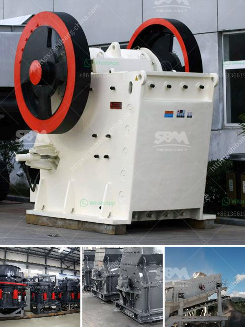

<h3>jaw crusher for sale in ghana</h3>
Jaw crushers are often used in the first stage of the material-handling process. They can accommodate very large pieces, reducing them into smaller, more manageable ones for further processing or transportation. The advantages of using a jaw crusher in quarries, construction sites, and mining applications are numerous. However, finding a jaw crusher for sale in Ghana may not be an easy task. Thus, this article seeks to provide a concise overview of where to find one in the country.

One of the most reliable and efficient crushing devices, the jaw crusher, is predominantly used in quarrying, mining, and recycling industries. It features a fixed, vertical jaw and a moving, swing jaw. The two jaws create a V-shaped cavity, where the materials are dropped and compressed as the movable jaw moves towards the fixed one.

In Ghana, the demand for jaw crushers is considerably higher than those for other types of crushing equipment. To meet this demand, the market welcomes a variety of jaw crushers available for sale, including those with different specifications and configurations. When purchasing a jaw crusher, it is important to consider the specific needs of the operation, as the size, capacity, and power requirements differ from one application to another.

To find a jaw crusher for sale in Ghana, it is best to seek for reliable online providers that have embodied several years of experience and expertise. AC Machinery is a leading mining and construction equipment manufacturer, striving to provide customers with advanced and optimal jaw crushers based on the performance and cost-effectiveness.

AC Machinery offers a wide range of jaw crushers for sale in Ghana, including PE jaw crusher, PEX jaw crusher, and JC jaw crusher. All these types of jaw crushers offer exceptional reliability and durability, ensuring that they are fit for purpose in the construction industry, the mining industry, and beyond.

In conclusion, finding a jaw crusher for sale in Ghana is not hard if you know where to look. AC Machinery aims to provide customers with reliable and efficient jaw crushers for improved operational efficiency and increased productivity.
<h3>Contact us</h3><ul><li><strong>Whatsapp:&nbsp;<a href="https://wa.me/8613661969651">+8613661969651</a></strong></li><li><a href="https://swt.shibang-china.com/?git&amp;zhl&amp;jaw crusher for sale in ghana"><strong>Online Service(chat now)</strong></a></li></ul><h3>Related</h3><ul><li><a href='sand and quarry importer in singapore.md'>sand and quarry importer in singapore</a></li><li><a href='equipment used in quarry crusher.md'>equipment used in quarry crusher</a></li><li><a href='samp hammer mill china.md'>samp hammer mill china</a></li><li><a href='business plan for clinker grinding plant.md'>business plan for clinker grinding plant</a></li><li><a href='impact crusher for iron ore.md'>impact crusher for iron ore</a></li></ul>