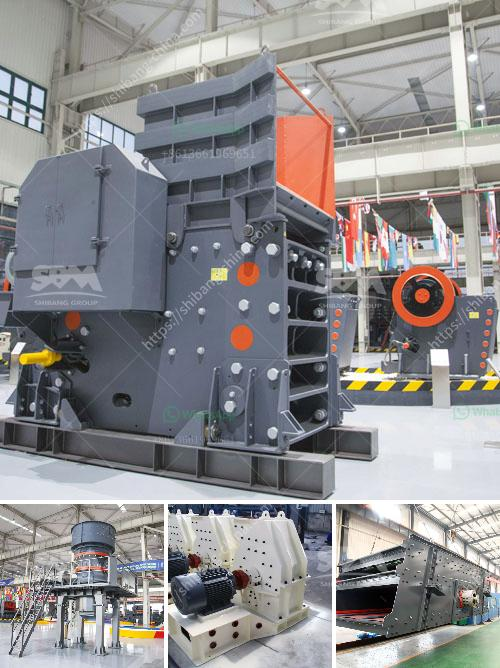

<h3>jaw crusher for sale in malaysia</h3>
Jaw crusher is a common crushing machine in stone crushing production line, especially for primary crushing. It has the features of large crushing ratio, uniform particle size, simple structure, reliable operation, and easy maintenance. Jaw crusher can be used as the primary crushing equipment. If you need a jaw crusher machine for sale, you can go to our website and take a look at it.

Jaw crusher for sale in Malaysia is a hot topic because Malaysia is rich in mineral resources, and it has a large number of stone quarries. With the increasing demand of construction aggregate in Malaysia, the market of jaw crusher for sale has been expanding rapidly.

Jaw crusher is mainly used in metallurgy, mining, chemical, cement, construction, refractory materials and ceramic industries for crushing and fine crushing various hard ores and rocks. It can be used for coarse crushing, medium crushing, and fine crushing. Thanks to its optimized and robust design, the jaw crusher can handle heavy-duty tasks and crush large-sized materials into smaller ones with great efficiency.

In addition to its wide applications, jaw crusher for sale in Malaysia is also widely used as mining equipment in the mining industry. With its reliable performance and low energy consumption, jaw crusher is sought after by so many mining operators. It can be one essential equipment for mining industry in Malaysia.

If you are looking for a jaw crusher for sale in Malaysia, you are in the right place. We provide jaw crusher machine for sale with different sizes and models. We supply customized solutions to meet your specific requirements. Our jaw crusher machines are reliable, efficient, and offer high productivity for a wide range of applications.

In conclusion, jaw crusher for sale in Malaysia is a reliable and efficient type of crushing equipment that is used in a variety of industries. It is an ideal option for crushing materials with compressive strength levels that are ranging from 147 to 245 MPa.
<h3>Contact us</h3><ul><li><strong>Whatsapp:&nbsp;<a href="https://wa.me/8613661969651">+8613661969651</a></strong></li><li><a href="https://swt.shibang-china.com/?git&amp;zhl&amp;jaw crusher for sale in malaysia"><strong>Online Service(chat now)</strong></a></li></ul><h3>Related</h3><ul><li><a href='6inch rock crushing mill in guatemala.md'>6inch rock crushing mill in guatemala</a></li><li><a href='bentonite crusher grinding mill mobile.md'>bentonite crusher grinding mill mobile</a></li><li><a href='plant of bentonite crusher.md'>plant of bentonite crusher</a></li><li><a href='vertical mills nigeria ball mill catalog.md'>vertical mills nigeria ball mill catalog</a></li><li><a href='crushing roller mill japan.md'>crushing roller mill japan</a></li></ul>