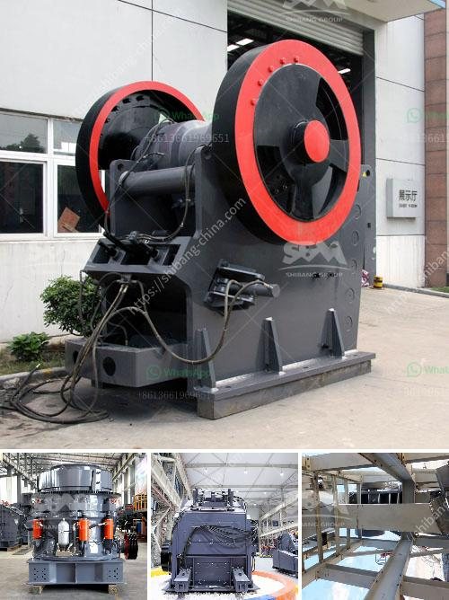

<h3>jaw crusher for sale in</h3>
A jaw crusher is a primary crusher that breaks down big rocks into smaller ones. This type of crushing machine has a history of more than 100 years, and it has been widely used in various fields such as mining, metallurgy, building materials, highways, railways, water conservancy, and chemical industries.

One of the key advantages of a jaw crusher for sale is its high productivity. The size of the crushed materials can be adjusted by controlling the feed opening and the discharge outlet. Besides, jaw crusher has a large crushing ratio and uniform product granularity, which is fairly suitable for the crushing of materials with a compressive strength less than 320 MPa.

Furthermore, jaw crusher for sale is easy to maintain and repair. It is compatible with different crushing materials and operational requirements. The use of a jaw crusher can save energy and time, and provide customers with a cost-effective crushing solution.

From the perspective of environmental protection, jaw crushing is a quite environmentally friendly crushing method with a low level of noise and dust pollution. Moreover, this crushing equipment can effectively solve the problem of dust control during the crushing process.

When looking for a jaw crusher for sale, there are a few key considerations to make. The first is the crusher's suitability for a particular application, ensuring that it matches the desired efficiency level. The second is the reliability and durability of the crusher. Jaw crushers are robust machines that can handle highly abrasive materials comfortably, making them a popular choice for aggregate producers.

Lastly, jaw crusher price will be a crucial factor to consider. Depending on the specific model, jaw crushers can be quite costly to run, so it is important to find one that is economical for the given operation. Jaw crusher comes with a motor that powers the machine, ensuring an efficient process.

Let us not forget about the jaw crusher's maintenance and repair in order to maximize its efficiency life span. Regularly check the wear parts for any wear and tear. Proper lubrication is also key to the performance of the jaw crusher.

In conclusion, the jaw crusher for sale in is the ideal choice for efficient crushing of hard and highly corrosive materials. It is often used as the main crusher in various crushing production lines. This jaw crusher has a high-tech design with advanced structural engineering and state-of-the-art production processes. It stands out for its reliability and durability, making it the perfect companion for diverse crushing operations.
<h3>Contact us</h3><ul><li><strong>Whatsapp:&nbsp;<a href="https://wa.me/8613661969651">+8613661969651</a></strong></li><li><a href="https://swt.shibang-china.com/?git&amp;zhl&amp;jaw crusher for sale in"><strong>Online Service(chat now)</strong></a></li></ul><h3>Related</h3><ul><li><a href='limestone impact crushers.md'>limestone impact crushers</a></li><li><a href='200 mesh ore grinder cost.md'>200 mesh ore grinder cost</a></li><li><a href='vsi crusher vertical shaft impact crusher.md'>vsi crusher vertical shaft impact crusher</a></li><li><a href='sand and gravel separation machine.md'>sand and gravel separation machine</a></li><li><a href='limestone processing plant price list.md'>limestone processing plant price list</a></li></ul>