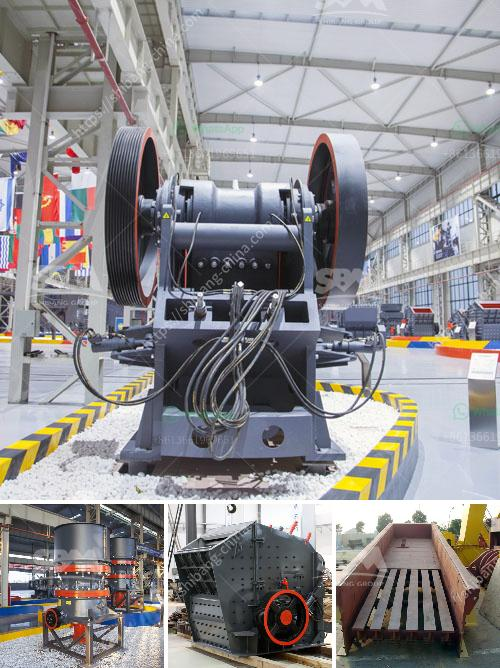

<h3>jaw crusher in algeria</h3>
Algeria is rich in various mineral resources, including oil, natural gas, gold, silver, zinc, copper, lead, uranium, iron ore, and other pristine and abundant resources. With the rapid development of the mining industry in Algeria, the jaw crusher is highly sought after by mining investors.

Jaw crushers are designed to crush and break large rocks into smaller rocks, gravel, or rock dust. They are used in a variety of industries, including mining, construction, and recycling. The jaw crusher has a strong crushing ability and high-quality end product with a wide range of applications.

In the mining industry, jaw crushers are used to crush the ore to a suitable size for further processing. It plays a crucial role in the primary crushing process, as it helps to reduce the size of the large rocks obtained from the mines. This allows for easier handling, transportation, and processing of the ore.

Additionally, jaw crushers are essential in the construction industry. They are used to crush construction debris, concrete, and other materials for recycling purposes. By recycling these materials, the construction industry can reduce waste and environmental impact.

The demand for jaw crushers in Algeria is increasing, as the mining and construction industries continue to grow. With the continuous development of infrastructure projects and the steady rise in construction activities, the jaw crusher is becoming an indispensable piece of equipment for Algerian businesses.

To meet the growing demand, many jaw crusher manufacturers have expanded their production capacities and introduced advanced technologies into their machines. This has resulted in improved efficiency, higher output, and longer service life.

In conclusion, the jaw crusher is an essential part of the mining and construction industries in Algeria. Its ability to crush large rocks into smaller rocks, gravel, or rock dust makes it a valuable tool for the extraction and processing of various minerals. As the Algerian mining industry continues to expand, the demand for jaw crushers is expected to rise further.
<h3>Contact us</h3><ul><li><strong>Whatsapp:&nbsp;<a href="https://wa.me/8613661969651">+8613661969651</a></strong></li><li><a href="https://swt.shibang-china.com/?git&amp;zhl&amp;jaw crusher in algeria"><strong>Online Service(chat now)</strong></a></li></ul><h3>Related</h3><ul><li><a href='were to buy old rock crusher.md'>were to buy old rock crusher</a></li><li><a href='barite mining equipment.md'>barite mining equipment</a></li><li><a href='crusher for silica.md'>crusher for silica</a></li><li><a href='kaolin separate beneficiation of iron.md'>kaolin separate beneficiation of iron</a></li><li><a href='indonesia coal screen machine.md'>indonesia coal screen machine</a></li></ul>