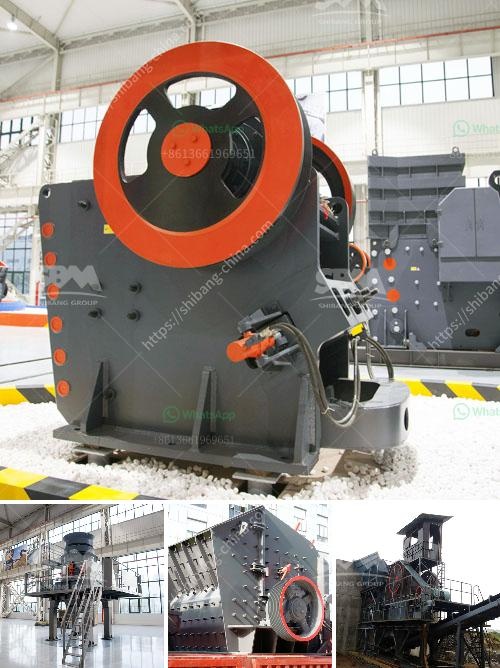

<h3>jaw crusher machine construction diagram</h3>
The jaw crusher is a versatile machine that is widely used in various industries. The construction diagram of a jaw crusher machine is shown in Figure 1.

The jaw crusher machine consists of a fixed jaw plate and a movable jaw plate. When the materials are fed into the crushing chamber, the movable jaw plate moves back and forth towards the fixed jaw plate to crush the materials. This allows the materials to be crushed and discharged through the discharge opening at the bottom.

The construction of the jaw crusher machine involves several components. Firstly, the frame of the machine provides support to all the other parts. It is made up of two side plates, a front frame, and a rear frame. The side plates are connected to the front and rear frames with bolts, creating a rigid structure.

The fixed jaw plate is attached to the front frame of the machine and cannot be moved. It is made of high-quality steel and is resistant to wear and tear. The purpose of the fixed jaw plate is to hold the materials in place and provide the necessary force to crush them.

The movable jaw plate is connected to the rear frame of the machine through a hinge mechanism. It can move back and forth, allowing the materials to be crushed. The movable jaw plate is also made of high-quality steel and is designed to withstand the force generated during the crushing process.

To ensure smooth operation, the jaw crusher machine is equipped with an eccentric shaft. The eccentric shaft is connected to the flywheel, which helps to generate the necessary energy for the crushing process. The flywheel is connected to the motor, which provides the power needed to drive the machine.

The crushing chamber of the jaw crusher machine is where the materials are crushed. It consists of a fixed jaw plate, a movable jaw plate, and a toggle plate. The toggle plate is connected to the rear frame of the machine and can move up and down. When the toggle plate moves downwards, it pushes the movable jaw plate towards the fixed jaw plate, crushing the materials.

In addition to these components, the jaw crusher machine may also include a hydraulic system. The hydraulic system is used to adjust the size of the discharge opening, allowing for different sizes of materials to be crushed. This feature makes the jaw crusher machine suitable for various applications.

In conclusion, the jaw crusher machine is a versatile and reliable machine that is widely used in construction, mining, and other industries. Its construction diagram consists of several components, including the frame, fixed jaw plate, movable jaw plate, eccentric shaft, flywheel, toggle plate, and hydraulic system. These components work together to crush the materials and provide efficient and effective crushing capabilities.
<h3>Contact us</h3><ul><li><strong>Whatsapp:&nbsp;<a href="https://wa.me/8613661969651">+8613661969651</a></strong></li><li><a href="https://swt.shibang-china.com/?git&amp;zhl&amp;jaw crusher machine construction diagram"><strong>Online Service(chat now)</strong></a></li></ul><h3>Related</h3><ul><li><a href='gold mining and crusher machinery.md'>gold mining and crusher machinery</a></li><li><a href='crusher in ethiopia.md'>crusher in ethiopia</a></li><li><a href='stone crusher machine price in philippines.md'>stone crusher machine price in philippines</a></li><li><a href='grinding mill barite.md'>grinding mill barite</a></li><li><a href='china jaw crusher importer in pakistan.md'>china jaw crusher importer in pakistan</a></li></ul>