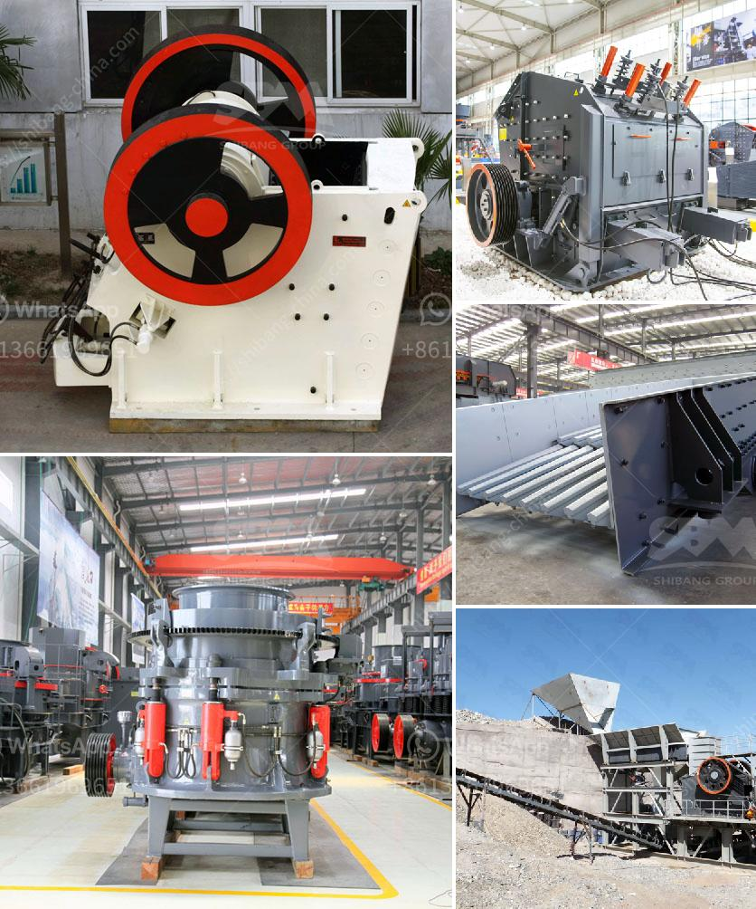

<h3>jaw crusher maharashtra</h3>
The jaw crusher is an essential piece of equipment in various industries, including mining, construction, and demolition. It is used to break large rocks into smaller pieces, making them more manageable and ready for further processing. In Maharashtra, a state in western India, the jaw crusher plays a vital role in the mining and construction industries.

Maharashtra is known for its rich mineral resources, including limestone, coal, bauxite, and manganese. The jaw crusher is particularly useful in the crushing and processing of these minerals. It has a strong and sturdy design, which allows it to handle heavy-duty tasks with ease. The machine's crushing chamber is deep and wide, allowing it to process large rocks efficiently.

One of the key advantages of the jaw crusher is its versatility. It can be used for a wide range of applications, from primary crushing to secondary or tertiary crushing. This flexibility makes it an ideal choice for various projects in Maharashtra. Whether it is crushing rocks to create aggregates for construction or pulverizing minerals for industrial purposes, the jaw crusher is a reliable and efficient machine.

Furthermore, the jaw crusher is easy to operate and maintain. It has simple controls and a user-friendly interface, making it accessible even for operators with minimal training. Regular maintenance is essential to ensure the smooth functioning of the machine, and Maharashtra has a well-developed infrastructure to support this requirement.

In conclusion, the jaw crusher is an indispensable machine in Maharashtra's mining and construction industries. Its robust design, versatility, and ease of operation make it a preferred choice for crushing and processing various minerals. With proper maintenance and support, the jaw crusher can continue to contribute significantly to the state's economic growth and development.
<h3>Contact us</h3><ul><li><strong>Whatsapp:&nbsp;<a href="https://wa.me/8613661969651">+8613661969651</a></strong></li><li><a href="https://swt.shibang-china.com/?git&amp;zhl&amp;jaw crusher maharashtra"><strong>Online Service(chat now)</strong></a></li></ul><h3>Related</h3><ul><li><a href='stone crusher plant project report.md'>stone crusher plant project report</a></li><li><a href='gravel wash plant for sale.md'>gravel wash plant for sale</a></li><li><a href='jaw crusher ethiopia.md'>jaw crusher ethiopia</a></li><li><a href='granite stone processing plant.md'>granite stone processing plant</a></li><li><a href='cone crusher manufacturers china.md'>cone crusher manufacturers china</a></li></ul>