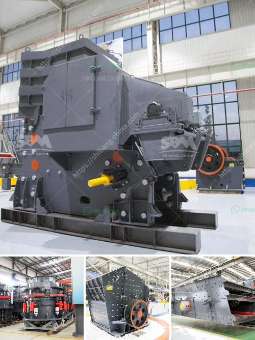

<h3>jaw crusher moby 600</h3>
The jaw crusher Moby 600 is a highly efficient and versatile machine that offers high-quality performance. This mobile jaw crusher is designed to provide excellent reduction and productivity, wherever it’s needed. Its dimensions and weight make it easier to transport and handle, which significantly reduces costs.

With a maximum feed size of 480 mm and a capacity range of 90-180 tons per hour, the Moby 600 is perfect for small to medium-sized operations. Its robust design ensures durability and longevity, even in the most demanding conditions. The powerful engine and high-quality components allow for efficient crushing, resulting in a product that is of superior quality and suitable for various applications.

The Moby 600 features a hydraulic jaw opening adjustment, which allows for quick and easy changes to the crusher’s settings. This ensures optimal performance and allows for precise control over the final product size. Additionally, the hydraulic system protects the crusher from any uncrushable materials, preventing any damage and ensuring continuous operation.

This jaw crusher is also equipped with a vibrating feeder that ensures a continuous flow of material to the crushing chamber. The integrated pre-screen allows for the separation of fine particles, ensuring a higher quality end product. The Moby 600 is also equipped with a magnetic separator, which helps remove any unwanted metal particles to protect the crusher and ensure the quality of the final product.

The Moby 600’s compact size and maneuverability make it ideal for use in various locations. Whether it's in recycling, construction, or quarrying applications, this jaw crusher delivers exceptional performance and productivity. Its versatility allows it to handle a wide range of materials, including hard and abrasive ones.

In conclusion, the jaw crusher Moby 600 is a reliable and efficient machine that delivers high-quality performance. Its compact size, versatility, and durability make it suitable for various uses. Whether you need it for recycling, construction, or quarrying, this mobile jaw crusher will exceed your expectations.
<h3>Contact us</h3><ul><li><strong>Whatsapp:&nbsp;<a href="https://wa.me/8613661969651">+8613661969651</a></strong></li><li><a href="https://swt.shibang-china.com/?git&amp;zhl&amp;jaw crusher moby 600"><strong>Online Service(chat now)</strong></a></li></ul><h3>Related</h3><ul><li><a href='quartz stone manufacturing plant.md'>quartz stone manufacturing plant</a></li><li><a href='crusher machine manufacturers.md'>crusher machine manufacturers</a></li><li><a href='concrete crusher for sale used in canada.md'>concrete crusher for sale used in canada</a></li><li><a href='jaw crusher 200 tonnes per hour.md'>jaw crusher 200 tonnes per hour</a></li><li><a href='mobile iron ore crusher.md'>mobile iron ore crusher</a></li></ul>