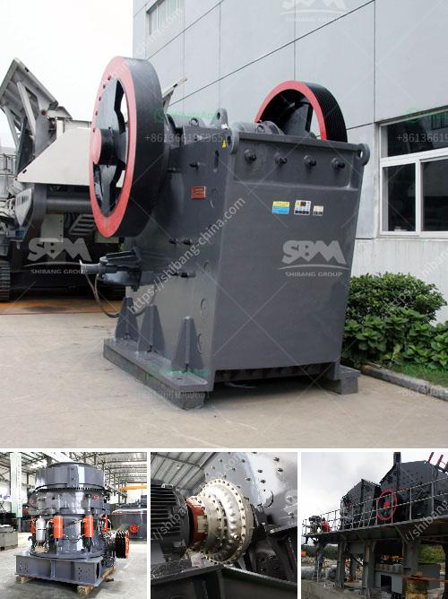

<h3>jaw crusher plant 20 tph</h3>
Jaw crusher plant 20 tph is becoming a significant trend in the world of crushing and screening equipment. The reason behind this is that the jaw crusher plant allows customers to recycle demolition waste, which helps reduce landfill costs. Additionally, the plant allows for targeted processing of various materials, including ores, rocks, and construction waste.

The jaw crusher plant 20 tph consists of a sturdy jaw crusher that utilizes state-of-the-art technology to deliver outstanding results. The innovative design ensures reliable performance, making this crushing unit an intelligent solution for various applications. It is not only efficient but also cost-effective, making it an ideal choice for contractors and quarry operators.

With a capacity of 20 tph, the jaw crusher plant can crush materials up to 500 mm in size. This makes it perfect for a wide range of applications, such as processing gravel, construction waste, or converting recycled materials into usable products. Moreover, the plant is equipped with a vibrating feeder, ensuring smooth and constant material flow to the crusher.

One of the key advantages of the jaw crusher plant 20 tph is its compact design. It occupies minimal space and can easily be transported from one site to another. This mobility makes it an excellent choice for contractors working on multiple job sites or those who need to frequently relocate their crushing operations.

In conclusion, the jaw crusher plant 20 tph offers a cost-effective and reliable solution for crushing operations. Its compact design, mobility, and ability to process different materials efficiently make it a versatile choice for contractors and quarry operators worldwide. This plant is set to revolutionize the recycling and crushing industry by reducing landfill costs and efficiently processing various materials.
<h3>Contact us</h3><ul><li><strong>Whatsapp:&nbsp;<a href="https://wa.me/8613661969651">+8613661969651</a></strong></li><li><a href="https://swt.shibang-china.com/?git&amp;zhl&amp;jaw crusher plant 20 tph"><strong>Online Service(chat now)</strong></a></li></ul><h3>Related</h3><ul><li><a href='how much cost to build a 50 ton cement plant.md'>how much cost to build a 50 ton cement plant</a></li><li><a href='cone crusher in china cone.md'>cone crusher in china cone</a></li><li><a href='sand crusher machine price at india.md'>sand crusher machine price at india</a></li><li><a href='jaw crusher maharashtra.md'>jaw crusher maharashtra</a></li><li><a href='small impact crusher.md'>small impact crusher</a></li></ul>