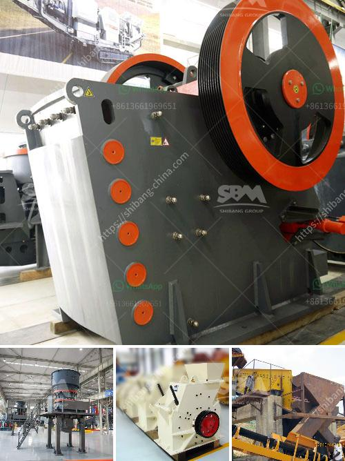

<h3>jaw crusher price in saudi</h3>
Jaw Crusher Price in Saudi Arabia is relatively low because the country itself is a rich oil-producing country and therefore has a strong industrial base. It is also considered one of the most stable economies in the Middle East. With an ever-growing population, demand for housing and infrastructure projects has been on the rise, which has led to an increase in the production of construction materials such as aggregate and cement. This has in turn boosted the demand for crushing equipment, particularly jaw crushers, in Saudi Arabia.

Jaw crusher is the most common primary crusher equipment in stone crushing plants and rock quarries. Jaw crusher is ideally suitable for primary and secondary crushing. Devo Machinery Co. Ltd, a leading manufacturer of crushing and screening equipment in China, provides jaw crusher price and specifications of jaw crushers for clients all over the world.

Jaw crusher price depends on different crusher models. As the leading mining crusher manufacturer with almost 40 year history in China, we will provide maximum preferential jaw crusher price for customers in Saudi Arabia. Here are some of the jaw crusher types and jaw crusher price list:

- PE-400×600 Jaw Crusher. This type of jaw crusher has a feed opening of 400×600 millimeters. It is suitable for middle and small-sized stone crushing projects. It has a motor power of 30 kilowatts and operates at a rated voltage of 380VAC.

- PE-500×750 Jaw Crusher. With a feed opening of 500×750 millimeters, this jaw crusher is ideal for large-scale stone crushing projects. It has a motor power of 55 kilowatts and operates at a rated voltage of 380VAC.

- PE-600×900 Jaw Crusher. This jaw crusher has a feed opening of 600×900 millimeters, making it suitable for larger stone crushing operations. It has a motor power of 75 kilowatts and operates at a rated voltage of 380VAC.

- PE-750×1060 Jaw Crusher. With a feed opening of 750×1060 millimeters, this jaw crusher is ideal for larger stone crushing projects. It has a motor power of 110 kilowatts and operates at a rated voltage of 380VAC.

These are just a few examples of jaw crusher models and specifications available. Customers can choose the appropriate jaw crusher model based on their specific crushing needs and project requirements.

In conclusion, the jaw crusher price in Saudi Arabia is relatively low due to the country's rich natural resources and stable economic development. With an increase in demand for construction materials, particularly aggregate and cement, the need for jaw crushers has risen. As a leading manufacturer of crushing and screening equipment, Devo Machinery Co. Ltd provides a range of jaw crusher models and specifications at competitive prices for customers in Saudi Arabia and around the world.
<h3>Contact us</h3><ul><li><strong>Whatsapp:&nbsp;<a href="https://wa.me/8613661969651">+8613661969651</a></strong></li><li><a href="https://swt.shibang-china.com/?git&amp;zhl&amp;jaw crusher price in saudi"><strong>Online Service(chat now)</strong></a></li></ul><h3>Related</h3><ul><li><a href='companies rent vibrating screens.md'>companies rent vibrating screens</a></li><li><a href='chrome ore processing plant price.md'>chrome ore processing plant price</a></li><li><a href='hammer mill and impactors unit.md'>hammer mill and impactors unit</a></li><li><a href='cone crushers for 3 mm.md'>cone crushers for 3 mm</a></li><li><a href='manganese crusher production line.md'>manganese crusher production line</a></li></ul>