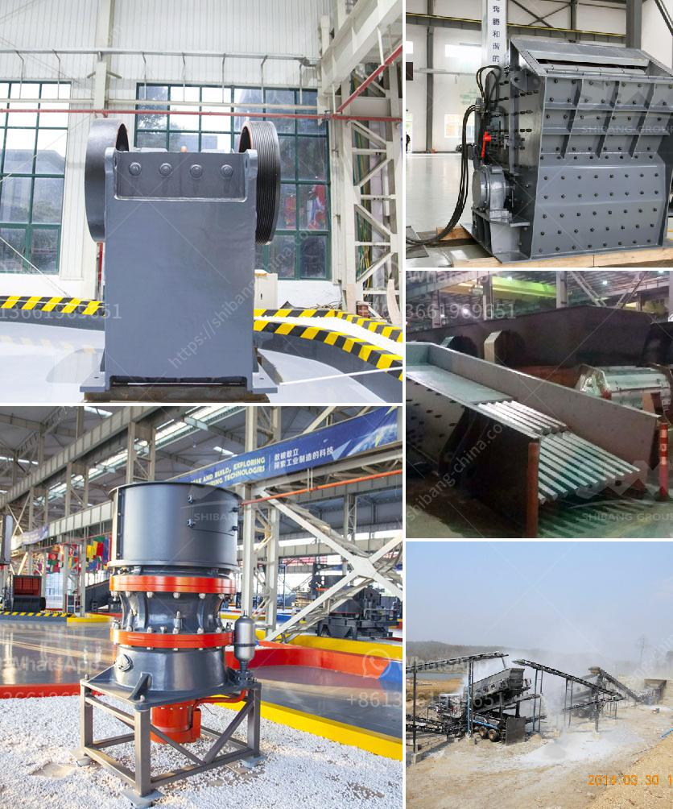

<h3>jaw crusher price nigeria</h3>
In Nigeria, the demand for jaw crushers is increasing rapidly in response to the unique needs of the country's infrastructure development. This is expected to drive the growth of the jaw crusher market in the region. It is well-known that Nigeria has the largest economy in Africa and the largest population, making it a major player in the African market.

Jaw crushers are widely used in various industries, such as mining, construction, metallurgy, smelting, hydraulic, and chemical industries. The main advantages of jaw crushers are simple structure, reliable operation, and convenient maintenance. They are suitable for crushing various materials with a compressive strength of not more than 320MPa.

When it comes to the prices of jaw crushers in Nigeria, we should firstly consider the following factors: raw materials, production capacity, and the specific technical requirements of customers. Jaw crushers are used to crush different types of materials, such as hard rocks, ore, building rubble, and glass. Jaw crushers can be divided into two types, namely, the simple swing jaw crusher and complex swing jaw crusher.

The price of jaw crushers in Nigeria is closely related to the model and capacity, as well as the quality and reputation of the supplier. With the increase in the price of raw materials and the continuous improvement of labor costs, the price of jaw crushers in Nigeria has attracted more and more attention from users. According to statistics, the price of jaw crushers in Nigeria has increased year by year since 2016.

For the mining and construction industry, Zenith is the best choice for your production needs. Based on years of abundant production experience and high technology, Zenith has produced high-quality and advanced mining machines for sale, crushing machine, grinding machine, and beneficiation equipment.

Zenith's jaw crusher price in Nigeria is affordable because of our superior technology and perfect service. Our jaw crusher is widely used for crushing various materials, such as stone, granite, trap rock, coke, coal, manganese ore, iron ore, emery, fused aluminum, oxide, fused calcium carbide, lime stone, quartzite, alloys, etc.

Typically, jaw crushers comprise of static crusher jaw and moving jaw, where the moving jaw moves periodically to interact with the static jaw. Jaw crushers are driven by a motor, and the moving jaw moves up and down via eccentric shaft. The angle between fixed jaw and moving jaw becomes smaller when the moving jaw runs down, then the materials are crushed into pieces. It becomes bigger when the moving jaw runs up. The moving jaw plate leaves the fixed jaw plate under the action of pole and spring, and then the end products come out from the crushing cavity.

In conclusion, jaw crusher price in Nigeria is different from supplier in demand and quality. Zenith has built a good reputation in Nigeria and has experience in establishing large-scale quarry plants. It effectively solves the difficulties in the crushing and recycling of building rubble and transforms the building waste into valuable materials, which greatly reduces the cost of waste treatment and improves the utilization rate of the building materials.
<h3>Contact us</h3><ul><li><strong>Whatsapp:&nbsp;<a href="https://wa.me/8613661969651">+8613661969651</a></strong></li><li><a href="https://swt.shibang-china.com/?git&amp;zhl&amp;jaw crusher price nigeria"><strong>Online Service(chat now)</strong></a></li></ul><h3>Related</h3><ul><li><a href='crushers plant price.md'>crushers plant price</a></li><li><a href='quartz stone crusher application.md'>quartz stone crusher application</a></li><li><a href='hammer mill and impactors unit.md'>hammer mill and impactors unit</a></li><li><a href='gypsum crusher supplier in uae.md'>gypsum crusher supplier in uae</a></li><li><a href='portable diamond washing plant.md'>portable diamond washing plant</a></li></ul>