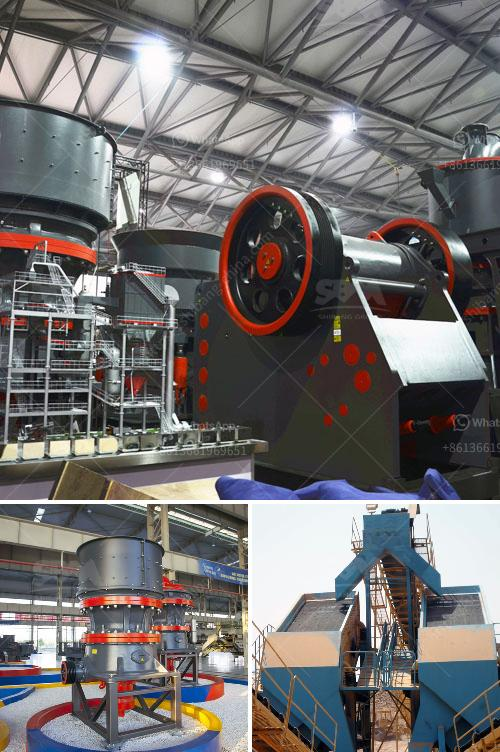

<h3>jaw crusher prices</h3>
When it comes to crushing equipment, the price of the machines are an important factor for most people. However, there are many factors impacting the prices of jaw crushers, such as specifications, quality, regions, market demands, and so on. By understanding the factors that impact jaw crusher prices, we can better analyze the reasons behind the high prices.

The most important factor influencing the price of jaw crushers is the specifications. Different models of jaw crushers have different specifications and sizes, which means their prices will also differ. For example, a 900x1200mm jaw crusher will have a higher price compared to a smaller model with the same feeding size, even though they may have the same output capacity. The larger the size of the jaw crusher, the higher the price is likely to be.

Another important factor is the quality of the jaw crusher. High-quality jaw crushers are made of durable and wear-resistant materials that can withstand extreme conditions. These materials increase the longevity of the equipment and prevent frequent breakdowns and repairs. Additionally, high-quality jaw crushers usually have advanced technology and better performance, which is why they are often priced higher.

Market demands and regions also play a significant role in determining jaw crusher prices. If there is a high demand for jaw crushers in a particular region, the prices will naturally be higher due to limited supply and increased competition. Similarly, if the costs of raw materials and labor in a certain region are higher, it will reflect in the final price of the equipment.

Furthermore, the reputation and brand value of the manufacturer can affect jaw crusher prices. Well-established brands that are known for their reliability and quality tend to have higher prices compared to lesser-known brands. This is because reputable manufacturers invest heavily in research and development, ensuring that their products meet industry standards and customer expectations.

The availability of spare parts is also a factor that impacts jaw crusher prices. If spare parts are readily available and affordable, the prices of jaw crushers tend to be lower. Conversely, if spare parts are hard to find or expensive, it can significantly increase the overall cost of owning and maintaining a jaw crusher.

In conclusion, jaw crusher prices are high due to various factors such as specifications, quality, market demands, regions, brand reputation, and spare part availability. It is important to carefully consider these factors when purchasing a jaw crusher to ensure that you get the best value for your money. Although high-priced jaw crushers may seem expensive initially, they often provide better performance, durability, and longevity in the long run. Therefore, it is advisable to invest in a high-quality jaw crusher rather than compromising on cost.
<h3>Contact us</h3><ul><li><strong>Whatsapp:&nbsp;<a href="https://wa.me/8613661969651">+8613661969651</a></strong></li><li><a href="https://swt.shibang-china.com/?git&amp;zhl&amp;jaw crusher prices"><strong>Online Service(chat now)</strong></a></li></ul><h3>Related</h3><ul><li><a href='iron ore processing plant.md'>iron ore processing plant</a></li><li><a href='price of a stone crusher machine in zambia.md'>price of a stone crusher machine in zambia</a></li><li><a href='dolomite crusher plant in kuwait.md'>dolomite crusher plant in kuwait</a></li><li><a href='hammer mill supplier in pretoria.md'>hammer mill supplier in pretoria</a></li><li><a href='clinker grinding plant.md'>clinker grinding plant</a></li></ul>