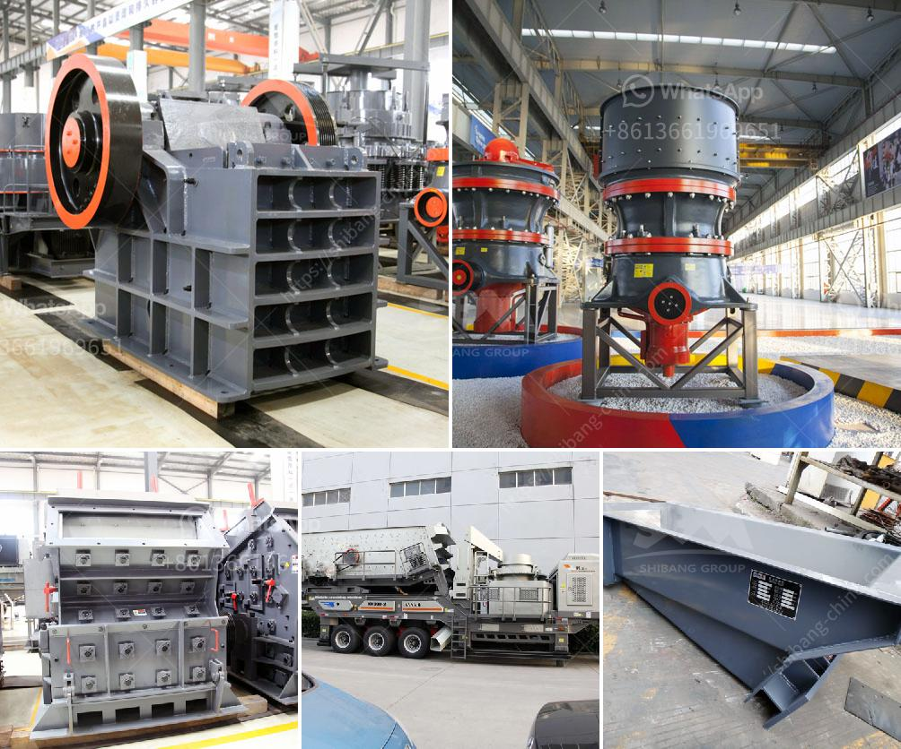

<h3>jaw crusher structure</h3>
Jaw crusher, commonly known as a rock crusher, is one of the most commonly used mining equipment. It is designed to crush large rocks into smaller rocks or gravel for further processing. The jaw crusher consists of a fixed jaw plate and a swing jaw plate that act as a clamping device for the materials being crushed. It is driven by two large flywheels, one at each end of the machine.

The structure of the jaw crusher plays a crucial role in ensuring its optimal performance and reliability. These components include the main frame, the jaw plates, the side plates, toggle plates, and the eccentric shaft. These components work together to generate the crushing action and provide the energy needed to break down the rocks.

The main frame is a robust structure that houses all the other components of the jaw crusher. It is made from high-quality steel and is reinforced with ribs and braces to ensure its strength and durability. The main frame also acts as a support for the eccentric shaft, which is responsible for the reciprocating motion of the swing jaw.

The swing jaw is attached to the eccentric shaft and moves back and forth against the fixed jaw, crushing the material in the process. The swing jaw is made up of a movable jaw plate and a fixed jaw plate, which are held in place by the toggle plates. The toggle plates act as a safety device, preventing the swing jaw from opening too wide and allowing uncrushable materials to enter the crushing chamber.

The side plates provide additional support for the jaw plates and help to maintain the proper alignment of the crushing chamber. They are also made from high-quality steel and are bolted to the main frame for easy maintenance and replacement.

In conclusion, the structure of the jaw crusher is essential for ensuring its reliable and efficient operation. Each component plays a crucial role in providing the necessary support and energy for crushing the rocks. Understanding the structure of the jaw crusher can help operators better maintain and troubleshoot the machine, ensuring its longevity and optimal performance.
<h3>Contact us</h3><ul><li><strong>Whatsapp:&nbsp;<a href="https://wa.me/8613661969651">+8613661969651</a></strong></li><li><a href="https://swt.shibang-china.com/?git&amp;zhl&amp;jaw crusher structure"><strong>Online Service(chat now)</strong></a></li></ul><h3>Related</h3><ul><li><a href='rock crusher for sale in sudan.md'>rock crusher for sale in sudan</a></li><li><a href='100tph used crusher plant for sale.md'>100tph used crusher plant for sale</a></li><li><a href='clay brick crusher manufacturers in pakistan.md'>clay brick crusher manufacturers in pakistan</a></li><li><a href='mobile crusher capacity 200 ton per hour.md'>mobile crusher capacity 200 ton per hour</a></li><li><a href='dealing in portable crusher machine.md'>dealing in portable crusher machine</a></li></ul>