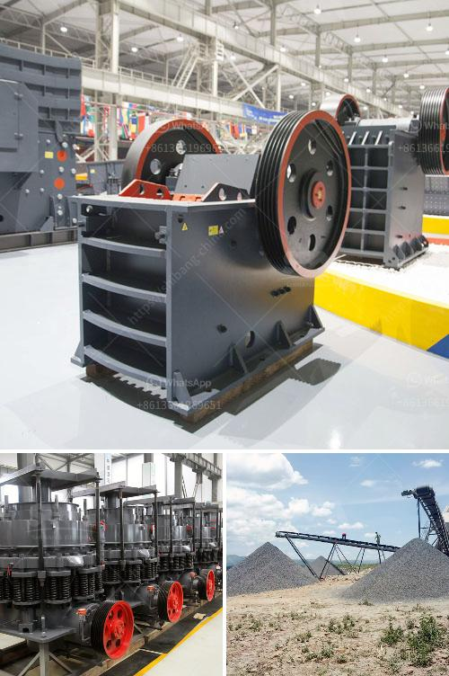

<h3>jaw crushers 100tph</h3>
Jaw crushers play a fundamental part in the stone crushing process. They are used to crush big stones into small particles that are essential for various industrial uses. For example, metal recycling companies rely on these crushers to reduce the size of waste materials they collect from demolition sites or excavated sites. Similarly, construction companies use jaw crushers to break down large bricks and concrete pieces into smaller rocks to use them as building material.

The concept behind jaw crushers is fairly simple. They have a fixed jaw plate and a moving jaw plate. When the materials are fed into the chamber and the motorized jaws start moving, the stones inside them are crushed between the two plates. As the jaws continue to move, the crushed stones are released, and new materials can be fed into the chamber for the process to repeat.

One of the key factors that make jaw crushers so popular is their efficiency. They can easily handle a wide range of materials, from very hard rocks to soft stones. This versatility makes them useful in many different industries. Additionally, jaw crushers are known for their reliability and low maintenance requirements. They are designed to withstand heavy-duty operations, ensuring a long lifespan with minimal problems.

When it comes to choosing the right jaw crusher, there are a few factors to consider. One of the main considerations is the feed size. Jaw crushers have different capacity levels and the size of the feed opening determines the maximum size of the stones that can be fed into the crushing chamber. The larger the feed opening, the larger the maximum feeding size.

For example, a 32 x 54 Jaw Crusher measures 32" from jaw die to jaw die at the top opening or gape opening, and 54” across the width of the two jaw dies. The narrower bottom opening of the crushing chamber is used to size the discharge material. A toggle plate and tension rods hold the pitman tight near the bottom of the moving swing jaw. The toggle plate is designed to perform like a fuse and protect the crusher in the event that an uncrushable material enters the crushing chamber. As a rule, Jaw Crushers have a 6:1 or 8:1 ratio for crushing material.

Still, using the 32 x 54 Jaw Crusher example, the top size of the feed entering the crushing chamber has to follow the F80 rule that 80% of the top size feed material is smaller than the gape opening. Using the F80 rule with the 32 x 54 Jaw Crusher, the 32” gape opening equals a 26” top sized feed, and with the 6:1 ratio of reduction, the discharge setting would be around 4".

Since the processing capacity of jaw crushers is relatively small and the feed size is limited, it is recommended to use the impact crusher or hammer crusher as the secondary crushing equipment. As a primary crushing equipment, jaw crusher has a high output and can process a large number of materials. It is commonly used as a selective crushing equipment, especially when processing soft or hard materials.

Jaw crushers can be classified into two types, namely single toggle jaw crusher and double toggle jaw crusher according to different jaw movements. Double toggle jaw crushers are usually used for crushing hard, abrasive rocks, glass and ferrous metals. Unlike single ones, double toggle jaw crushers are much heavier and have a lot of moving parts. Plus, they don’t include rotary motion. Instead, they crush materials between two massive jaw plates. The crushing process happens, when the feed material between the two jaws is compressed.

Another distinguishing factor between the two is that the position of the eccentric is different. The eccentric in a double-toggle jaw crusher is found behind the swinging jaw, while the eccentric on the single-toggle jaw crusher is located at the top.

Jaw crushers are essential crushers in stone and rock crushing lines. They enable solid waste materials to be effectively crushed, easily transported, and further processed. Their robust design and compact size enable them to work in confined spaces and under harsh conditions. Therefore, jaw crushers are widely used in mining, construction, and recycling industries, with good reason.
<h3>Contact us</h3><ul><li><strong>Whatsapp:&nbsp;<a href="https://wa.me/8613661969651">+8613661969651</a></strong></li><li><a href="https://swt.shibang-china.com/?git&amp;zhl&amp;jaw crushers 100tph"><strong>Online Service(chat now)</strong></a></li></ul><h3>Related</h3><ul><li><a href='vsi crusher machine.md'>vsi crusher machine</a></li><li><a href='dolomite crusher manufacturer in nagpur.md'>dolomite crusher manufacturer in nagpur</a></li><li><a href='crawler type mobile crushers.md'>crawler type mobile crushers</a></li><li><a href='crusher prices of mobile crusher in bolivia.md'>crusher prices of mobile crusher in bolivia</a></li><li><a href='m sand manufacturing machine.md'>m sand manufacturing machine</a></li></ul>