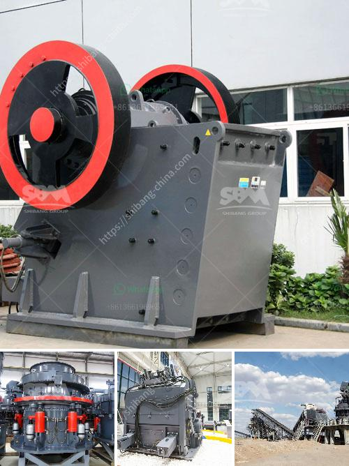

<h3>jaw stone crushers in usa</h3>
The term "jaw crusher" primarily refers to a machine that utilizes the squeezing motion of a jaw plate to crush materials within a cavity. Jaw stone crushers in USA are commonly used in mining, metallurgy, building materials, railway, water conservancy, chemical and other industries. Therefore, jaw stone crushers are employed in various projects providing ample opportunities for increasing their market footprint.

The jaw stone crushers in USA are suitable for crushing various materials with compressive strength below 320 MPa. The discharging granularity can be adjusted according to the needs of users. Crushing materials with different hardness and different sizes can achieve different final particle sizes, thus giving customers more choices. The unique deep "V" shaped crushing chamber design maximizes the jaw plate's effective length, so as to extend its service life and improve crushing efficiency.

One major advantage of jaw stone crushers in USA is their productive capacity. The jaw crusher machines are driven by motors through a belt and pulley system. By utilizing a cam or pitman mechanism, the jaw crushers are capable of producing materials with high output. The structure of these crushers allows for easy operation, maintenance, and adjustment.

Another advantage of jaw stone crushers in USA is the fact that they are built to last. This heavy-duty construction allows these machines to withstand tough working conditions, such as high-temperature and high-pressure environments. The robust design ensures their longevity, reducing the need for frequent repairs and replacements.

Furthermore, jaw stone crushers in USA offer a wide range of applications. Thanks to their simple structure and reliable performance, they can be applied to primary crushing, secondary crushing, and fine crushing of materials. These crushers can also be used to crush materials with different hardness levels, such as granite, basalt, quartz, river pebble, iron ore, limestone, copper ore, and others. This versatility in crushing materials provides flexibility to various industries and construction projects.

Additionally, jaw stone crushers in USA are cost-effective. They are affordable and offer a comparatively low cost per ton of crushed material. This makes them an ideal choice for businesses with limited budgets but requiring efficient and reliable crushing equipment.

The growing demand for jaw stone crushers in USA is due to their numerous advantages and wide range of applications. These machines are essential equipment for various industries, especially in the mining and construction sectors. As technology continues to advance, jaw stone crushers are becoming more efficient, durable, and user-friendly, making them a crucial component in many projects.

Overall, the jaw stone crushers in USA are highly efficient machines that offer numerous benefits to different industries. From their high productivity and ease of use to their durability and cost-effectiveness, they are an asset to any business in need of quality crushing equipment. As the demand for construction materials and mineral resources continues to rise, the importance and demand for jaw crushers will continue to grow in the United States.
<h3>Contact us</h3><ul><li><strong>Whatsapp:&nbsp;<a href="https://wa.me/8613661969651">+8613661969651</a></strong></li><li><a href="https://swt.shibang-china.com/?git&amp;zhl&amp;jaw stone crushers in usa"><strong>Online Service(chat now)</strong></a></li></ul><h3>Related</h3><ul><li><a href='the crunch hand operated rock crusher.md'>the crunch hand operated rock crusher</a></li><li><a href='indonesia ball mill.md'>indonesia ball mill</a></li><li><a href='cement clinker grinding and packing plant.md'>cement clinker grinding and packing plant</a></li><li><a href='zhauns south africa price list pdf.md'>zhauns south africa price list pdf</a></li><li><a href='price of grinding mills in uganda.md'>price of grinding mills in uganda</a></li></ul>