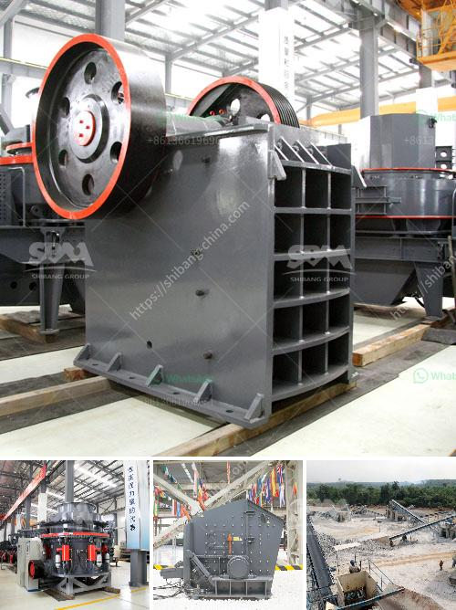

<h3>jual jaw stone advanced bauxite crusher</h3>
When it comes to mining operations or construction projects, jaw stone advanced bauxite crushers are indispensable machines. Advancing technology and innovative techniques ensure that they are a preferred choice for crushing rocks and stones in various industries. Therefore, if you are in the market for such a machine, you should consider the jaw stone crusher.

The advanced bauxite crusher is one of the essential machines used in the mining and construction industry. This crusher helps to crush large stones and rocks into smaller pieces, improving efficiency and reducing costs. Moreover, it ensures that the final product is of uniform size and quality. With its ability to crush different types of materials, the jaw stone crusher is a versatile machine suitable for any mining or construction project.

One of the primary benefits of using the jaw stone crusher is its simplicity in operation. It is easy to use, making it an ideal choice for both novice and experienced operators. Its simple design and compact size allow for convenient installation and maintenance. Additionally, it has a straightforward working mechanism, with an easy-to-use control panel.

The advanced bauxite crusher offers exceptional performance and efficiency, thanks to its powerful motor and robust construction. It can handle heavy-duty applications and withstand harsh working conditions, making it a reliable choice for demanding projects. With its high crushing ratio, this machine crushes rocks and stones effectively, resulting in a more refined final product.

Another advantage of the jaw stone advanced bauxite crusher is its versatility in crushing various types of materials. Whether you need to crush hard, medium-hard, or soft rocks, this machine can handle them all. From limestone and basalt to granite and ore, it can efficiently crush different materials with ease. Its adjustable settings allow you to control the size of the final product according to your specific requirements.

In addition to its performance and versatility, the jaw stone crusher also offers cost benefits. It consumes less power, reducing energy costs and making it an economical choice for your mining or construction project. Its durability and low maintenance requirements further contribute to cost savings, as you spend less time and money on repairs and replacements.

In conclusion, if you are in need of a reliable and versatile machine for your mining or construction project, the jaw stone advanced bauxite crusher is the solution. With its simplicity in operation, high performance, and cost benefits, it is a must-have machine in your mining arsenal. Whether you need to crush rocks, stones, or other materials, this crusher ensures efficiency, quality, and uniformity in the final product. So, consider investing in the jaw stone advanced bauxite crusher and experience its numerous benefits in your operations.
<h3>Contact us</h3><ul><li><strong>Whatsapp:&nbsp;<a href="https://wa.me/8613661969651">+8613661969651</a></strong></li><li><a href="https://swt.shibang-china.com/?git&amp;zhl&amp;jual jaw stone advanced bauxite crusher"><strong>Online Service(chat now)</strong></a></li></ul><h3>Related</h3><ul><li><a href='grinding units of feldspar.md'>grinding units of feldspar</a></li><li><a href='hammer mill crusher batubara.md'>hammer mill crusher batubara</a></li><li><a href='crusher price in kazakhstan.md'>crusher price in kazakhstan</a></li><li><a href='stone crusher uganda.md'>stone crusher uganda</a></li><li><a href='limestone crusher machine in turkey.md'>limestone crusher machine in turkey</a></li></ul>