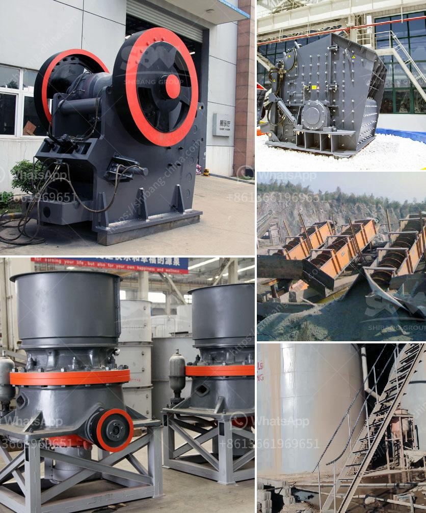

<h3>jual stone crusher second jakarta</h3>
When it comes to construction and mining projects, finding high-quality equipment is crucial. As a result, it is important to invest in machinery that will last for years, guaranteeing optimal performance and reliability. This is where the jual stone crusher second Jakarta comes into play.

The stone crusher is a robust and powerful machine designed to tackle a variety of tasks. These tasks include crushing stones, rocks, and concrete easily and efficiently. This versatile machine ensures reliability and efficiency when crushing and grinding materials, enhancing the overall productivity and profitability of construction and mining projects.

Investing in a jual stone crusher second Jakarta provides numerous advantages for businesses. Firstly, it allows for cost-effective hydraulic crushing, solving construction and recycling challenges. With its high-power engine, the crusher is capable of handling even the toughest materials, reducing them into required sizes efficiently.

Moreover, the second-hand stone crusher in Jakarta offers great flexibility for customers who have limited budget. During operation, it requires minimal maintenance, which reduces operational costs significantly. Furthermore, the spare parts and components that are necessary to maintain the machine are readily available in the market, making it easy to keep the crusher running smoothly.

Another advantage of investing in a jual stone crusher second Jakarta is the wide range of applications it offers. This machine is ideal for both primary and secondary crushing, ensuring that the finished products are of consistent quality. With its ability to break down various types of materials, such as hard rocks, ores, and minerals, the crusher is suitable for construction, road building, mining, and other industries.

Safety is always a priority in any construction or mining project. The jual stone crusher second Jakarta comes equipped with advanced safety features, minimizing the risk of accidents during operation. These safety measures include an automatic control system that regulates the feeder speed and ensures continuous, safe feeding of materials into the crusher.

In addition to safety, the crusher also offers environmental benefits. Its low noise and emission levels make it an environmentally friendly choice. This is especially important in urban areas, where minimizing noise and air pollution is crucial for maintaining a sustainable environment.

In conclusion, investing in a jual stone crusher second Jakarta offers a reliable and cost-effective solution for businesses in the construction and mining industries. With its versatility, high power, and low maintenance requirements, the crusher is capable of handling various tasks, ensuring the efficient crushing and grinding of materials. Moreover, its advanced safety features and environmental benefits make it an ideal choice for projects in urban areas.

When it comes to finding a reliable stone crusher, look no further than the jual stone crusher second Jakarta. This machine guarantees high-quality performance, allowing businesses to achieve their goals efficiently and effectively. Don't miss out on this investment opportunity, which promises to enhance productivity and profitability in any construction or mining project.
<h3>Contact us</h3><ul><li><strong>Whatsapp:&nbsp;<a href="https://wa.me/8613661969651">+8613661969651</a></strong></li><li><a href="https://swt.shibang-china.com/?git&amp;zhl&amp;jual stone crusher second jakarta"><strong>Online Service(chat now)</strong></a></li></ul><h3>Related</h3><ul><li><a href='crushed price impact crusher price.md'>crushed price impact crusher price</a></li><li><a href='labratory hammer mill.md'>labratory hammer mill</a></li><li><a href='standards sizes of conveyor belts.md'>standards sizes of conveyor belts</a></li><li><a href='quarry causer machine.md'>quarry causer machine</a></li><li><a href='track impact crusher.md'>track impact crusher</a></li></ul>