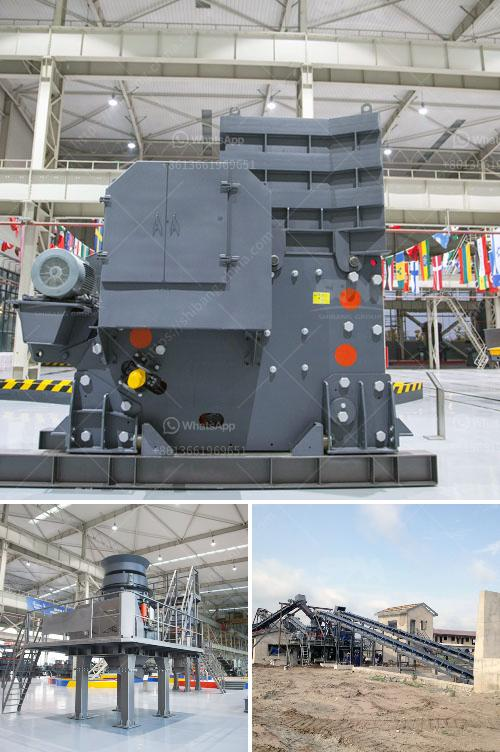

<h3>kaolin crusher processing in japan</h3>
Kaolin is a mineral that is found in abundance in Japan. It is widely used to produce various products like paper, ceramics, rubber, and paints. However, before it can be utilized in these industries, it needs to be processed using a kaolin crusher.

The crushing process involves the use of a crusher machine, which breaks the larger chunks of kaolin into smaller pieces. These pieces then undergo further grinding to achieve the desired particle size. This process is crucial as it enhances the properties of kaolin and ensures its suitability for various applications.

Japan is known for its advanced technological capabilities, and the processing of kaolin is no exception. Japanese manufacturers have developed state-of-the-art crushers that are capable of efficiently crushing kaolin chunks into smaller particles. These crushers are equipped with powerful motors, sharp blades, and advanced control systems to ensure high productivity and superior quality of the processed kaolin.

The kaolin crusher processing in Japan is a well-established industry, with several manufacturers competing in the market. This competition has led to constant innovation and improvement in the design and functionality of these crushers. As a result, the processing efficiency has increased, and the overall quality of the processed kaolin has improved.

One of the key factors driving the demand for kaolin crusher processing in Japan is the country's robust manufacturing sector. Japan is home to numerous industries that utilize kaolin in their production processes. These industries require a reliable supply of high-quality kaolin, which can only be achieved through efficient crusher processing.

Furthermore, the Japanese government has recognized the importance of kaolin crusher processing in supporting the country's economy. It has implemented policies and incentives to encourage investment in this sector. This has attracted both domestic and foreign manufacturers to establish their crusher processing facilities in Japan, further boosting the industry's growth.

In recent years, there has been an increasing focus on sustainable and eco-friendly practices in the kaolin crusher processing industry. Japanese manufacturers have responded to this demand by developing crushers that are energy-efficient and environmentally friendly. These crushers minimize energy consumption and reduce emissions, making them more sustainable choices for kaolin processing.

Overall, kaolin crusher processing in Japan plays a vital role in supporting various industries and contributing to the country's economic growth. The advanced technology, constant innovation, and commitment to sustainability have positioned Japan as a leader in this field. The industry's future looks promising with the continuous development of more efficient and eco-friendly crusher processing technologies.
<h3>Contact us</h3><ul><li><strong>Whatsapp:&nbsp;<a href="https://wa.me/8613661969651">+8613661969651</a></strong></li><li><a href="https://swt.shibang-china.com/?git&amp;zhl&amp;kaolin crusher processing in japan"><strong>Online Service(chat now)</strong></a></li></ul><h3>Related</h3><ul><li><a href='ball mill turkey fabricant.md'>ball mill turkey fabricant</a></li><li><a href='dolomite roller mill.md'>dolomite roller mill</a></li><li><a href='china talc processing factory.md'>china talc processing factory</a></li><li><a href='stone crusher plant philippines.md'>stone crusher plant philippines</a></li><li><a href='coal washing process machine price.md'>coal washing process machine price</a></li></ul>