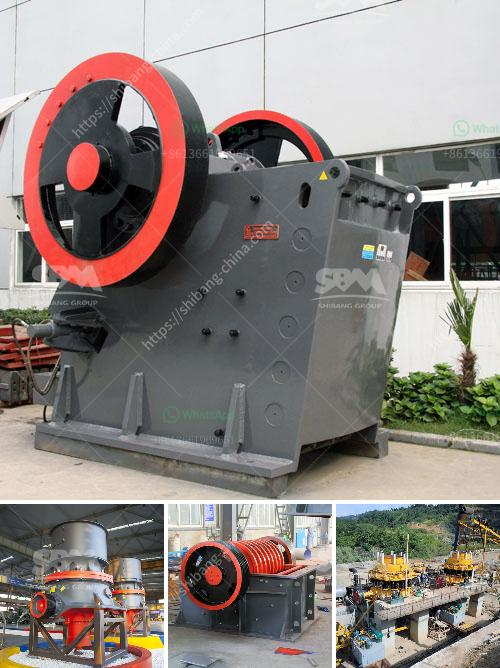

<h3>kaolin indonesia crusher manufacturer</h3>
Kaolin, a type of clay that is derived from the mineral kaolinite, is an essential ingredient in the manufacturing of countless industrial products. Its unique properties make it highly valuable in various industries such as ceramics, papermaking, plastics, rubber, and cosmetics. As the demand for kaolin continues to rise, it is crucial to find a reliable and efficient crusher manufacturer in Indonesia.

One of the leading suppliers of kaolin in Indonesia is PT. Karya Utama Phibis. Established in 1996, this company has consistently provided high-quality kaolin products to both domestic and international markets. With their commitment to excellence and continuous innovation, they have become a trusted name in the industry.

PT. Karya Utama Phibis understands the importance of a reliable crusher in the production process. That is why they have invested in state-of-the-art crushing equipment to ensure the highest quality final product. Their crusher machines are designed to efficiently break down large chunks of raw kaolin into smaller particles, making it easier for further processing.

One of the key advantages of PT. Karya Utama Phibis as a crusher manufacturer is their emphasis on sustainable practices. They are dedicated to minimizing the environmental impact of their operations by implementing eco-friendly technologies. This includes using energy-efficient crushers that reduce power consumption and employing water recycling systems to minimize water usage.

Furthermore, PT. Karya Utama Phibis is committed to responsible mining practices. They operate their kaolin mines responsibly, ensuring that the surrounding ecosystems are protected. They also have efficient reclamation processes in place to restore the land after extraction, minimizing long-term environmental effects.

In addition to their focus on sustainability, PT. Karya Utama Phibis places a strong emphasis on quality control. They have a dedicated team of experts who closely monitor the entire production process, from mining to crushing and packaging. This ensures that the kaolin products they deliver consistently meet the highest standards of purity and quality.

Another advantage of choosing PT. Karya Utama Phibis as your kaolin crusher manufacturer is their commitment to customer satisfaction. They understand the unique requirements of different industries and work closely with their clients to provide tailored solutions. Their experienced team is always ready to provide technical support and guidance in selecting the most suitable kaolin products for each application.

Furthermore, PT. Karya Utama Phibis has an extensive distribution network, enabling them to efficiently deliver their products to customers across Indonesia and beyond. They offer flexible packaging options to meet specific customer needs, ensuring that the kaolin products arrive in perfect condition.

In conclusion, for those seeking a reliable crusher manufacturer for kaolin in Indonesia, PT. Karya Utama Phibis is a top choice. Their commitment to sustainability, quality control, customer satisfaction, and efficient distribution sets them apart in the industry. By choosing them as your partner, you can be confident in receiving high-quality kaolin products that meet your specific requirements.
<h3>Contact us</h3><ul><li><strong>Whatsapp:&nbsp;<a href="https://wa.me/8613661969651">+8613661969651</a></strong></li><li><a href="https://swt.shibang-china.com/?git&amp;zhl&amp;kaolin indonesia crusher manufacturer"><strong>Online Service(chat now)</strong></a></li></ul><h3>Related</h3><ul><li><a href='salary of crusher operer in philippines.md'>salary of crusher operer in philippines</a></li><li><a href='ball mill manufacturers gypsum.md'>ball mill manufacturers gypsum</a></li><li><a href='dolomite crushing plant in bharuch.md'>dolomite crushing plant in bharuch</a></li><li><a href='raymond mill in chennai.md'>raymond mill in chennai</a></li><li><a href='canadian gold mining equipment manufacturers.md'>canadian gold mining equipment manufacturers</a></li></ul>