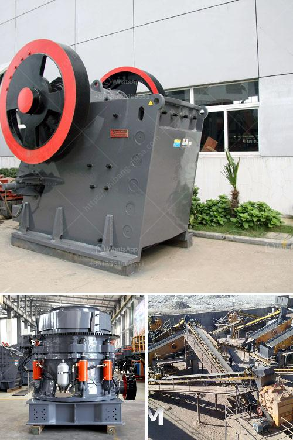

<h3>kaolin separate beneficiation of iron</h3>
Kaolin, also known as china clay, is a white, soft, and plastic clay mineral extensively used in ceramics, paper, pharmaceuticals, cosmetics, and various other industries. While kaolin is popularly used in these applications, it also holds immense potential in the beneficiation of iron ore.

The beneficiation of iron ore involves various processes such as crushing, grinding, magnetic separation, and froth flotation. Several studies have been conducted to evaluate the feasibility of these processes in the kaolin industry, resulting in the development of a separate beneficiation process for iron in kaolin.

The first step in the separate beneficiation of iron in kaolin is to remove the impurities. Various techniques, such as scrubbing, gravity separation, and froth flotation, can be employed to remove impurities like titania, pyrite, and other organic matter. Scrubbing is often the initial step as it helps in breaking down larger particles and removing surface impurities.

After scrubbing, gravity separation techniques can be used to remove the coarser impurities. Gravity separation is based on the difference in specific gravity between the kaolin and impurities. Methods such as jigging, spiral concentration, and shaking tables can be utilized to separate the heavier impurities. This step is crucial as it reduces the impurity content, thus improving the quality of the kaolin.

Once the initial impurities are removed, froth flotation can be employed to separate iron minerals from kaolin. Froth flotation is a common technique used to separate minerals from ore based on their hydrophobicity. In the case of kaolin, iron minerals are often hydrophobic, which means they repel water. By introducing a frothing agent and a collector into the slurry, the mineral particles can attach to bubbles and rise to the surface, where they can be collected.

Since iron minerals in kaolin are often finely dispersed, achieving effective flotation can be challenging. To optimize the flotation process, various factors such as pH, temperature, collector dosage, frother dosage, and flotation time need to be considered. By systematically altering these parameters, researchers have successfully developed a suitable flotation process for iron minerals in kaolin.

The separate beneficiation of iron in kaolin offers several advantages. Firstly, it allows for the removal of impurities that could adversely affect the quality of kaolin in applications like ceramics and paper. Secondly, the recovered iron minerals can serve as a valuable byproduct. Iron minerals extracted from kaolin can be further processed for various industrial uses, including pigments, magnetic materials, and catalysts.

Overall, the separate beneficiation of iron with kaolin is an innovative and promising approach. By removing impurities and utilizing froth flotation, a high-quality kaolin product can be obtained, while simultaneously recovering valuable iron minerals. With further research and development, this beneficiation process has the potential to revolutionize the kaolin industry and contribute to the sustainable utilization of mineral resources.
<h3>Contact us</h3><ul><li><strong>Whatsapp:&nbsp;<a href="https://wa.me/8613661969651">+8613661969651</a></strong></li><li><a href="https://swt.shibang-china.com/?git&amp;zhl&amp;kaolin separate beneficiation of iron"><strong>Online Service(chat now)</strong></a></li></ul><h3>Related</h3><ul><li><a href='dolomite lime process for agriculure.md'>dolomite lime process for agriculure</a></li><li><a href='mini cement plant for sale 500tpd.md'>mini cement plant for sale 500tpd</a></li><li><a href='cement clinker grinding and packing plant.md'>cement clinker grinding and packing plant</a></li><li><a href='cone crusher in china cone.md'>cone crusher in china cone</a></li><li><a href='hammer mills kenya.md'>hammer mills kenya</a></li></ul>