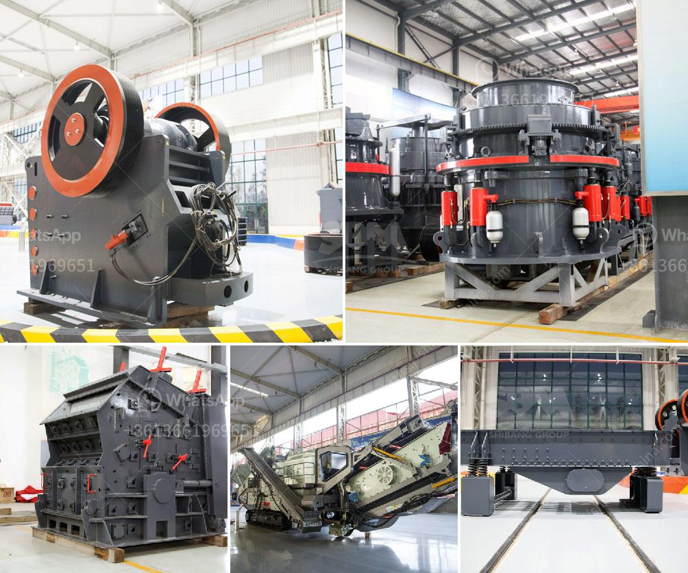

<h3>kenya crushing machinery performance</h3>
Kenya, known for its breathtaking natural beauty and diverse wildlife, has also made significant strides in various industries. One of the key sectors witnessing rapid growth is the mining and construction industry. With the demand for infrastructure development and mineral extraction soaring, the need for advanced crushing machinery has become paramount.

The performance of crushing machinery in Kenya has become a pivotal aspect in determining the success of construction projects and mining operations. This machinery is crucial in breaking down large rocks, stones, or minerals into smaller fragments, enabling their further use in various applications. To understand the significance of crushing machinery in Kenya, let us delve into the factors that contribute to its remarkable performance.

The rugged terrain and demanding conditions in Kenya necessitate robust and durable crushing machinery. Manufacturers have stepped up to the challenge by producing machines specifically designed to withstand the harsh African environment. Resilient components and superior build quality ensure the equipment remains operational even in adverse conditions, thereby enhancing productivity and minimizing downtime.

Maximizing operational efficiency is a primary concern for Kenya's mining and construction industry. Crushing machinery plays a vital role in achieving this objective by incorporating advanced features that enhance productivity. These machines boast high-speed crushing technology, enabling quick and efficient processing of materials, thus reducing overall project timelines.

Moreover, the versatile nature of crushing machinery allows for easy adaptation to various applications. Whether it is aggregate production, quarrying, or recycling, these machines can be fine-tuned to meet specific requirements. This versatility allows businesses to use the machinery in multiple sectors, thereby optimizing its utilization and return on investment.

Kenya, like many nations, acknowledges the importance of environmental sustainability. Mining and construction activities can have a significant impact on the environment if not properly managed. Crushing machinery manufacturers have taken this concern into account while designing their equipment. Advanced models feature state-of-the-art dust suppression systems that mitigate airborne pollutants generated during crushing operations. Additionally, the efficient use of energy and the incorporation of eco-friendly materials in the machinery contribute to reducing the industry's overall carbon footprint.

Worker safety is of paramount importance in any industry, and crushing operations are no exception. Modern crushing machinery in Kenya incorporates innovative safety features to protect operators from potential hazards. Machinery equipped with sensors and automation ensures the prevention of accidents and injuries. Emergency stop buttons and advanced control systems offer real-time monitoring, ensuring safe and efficient operations.

The performance of crushing machinery in Kenya is not limited to its actual operation. Affordability and cost-effectiveness play a vital role in the market competitiveness of such equipment. Manufacturers understand the need for value-driven solutions, providing high-performance machinery at competitive prices. Such affordability enables both large-scale businesses and smaller enterprises to invest in crushing equipment, driving overall industry growth and development.

Kenya's mining and construction industry is witnessing a revolution, with crushing machinery at the forefront. The unrivaled performance of these machines, in terms of durability, efficiency, versatility, environmental sustainability, and safety, all contribute to successful project execution. As the nation paves its path towards economic development, it is commendable to witness the remarkable progress made in this vital sector.
<h3>Contact us</h3><ul><li><strong>Whatsapp:&nbsp;<a href="https://wa.me/8613661969651">+8613661969651</a></strong></li><li><a href="https://swt.shibang-china.com/?git&amp;zhl&amp;kenya crushing machinery performance"><strong>Online Service(chat now)</strong></a></li></ul><h3>Related</h3><ul><li><a href='price for sand machine.md'>price for sand machine</a></li><li><a href='price of cocoa processing equipment.md'>price of cocoa processing equipment</a></li><li><a href='concrete aggregates crushing plant for sale.md'>concrete aggregates crushing plant for sale</a></li><li><a href='stone crusher uganda.md'>stone crusher uganda</a></li><li><a href='calcite quarry crusher sri lanka.md'>calcite quarry crusher sri lanka</a></li></ul>