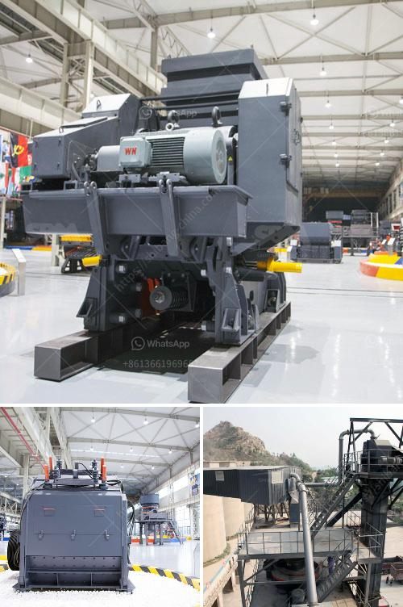

<h3>kenya sellers of used stone crushers</h3>
Kenya is one of the countries with a sound economic blueprint that has seen its markets grow steadily. With the increase in demand for various types of crushers, buyers can now easily find Kenya sellers of used stone crushers. In order to meet different construction needs, there are varied types of crushers available in Kenya. These include jaw crushers, cone crushers, impact crushers, and even mobile crushers.

However, not all sellers of used stone crushers are able to provide quality machines. Therefore, buyers need to carefully consider various factors such as location, brand, model, condition, and price before making a purchase. It is advisable to visit the seller's location in order to evaluate the condition of the machine and ensure that it meets the specified requirements.

One of the key advantages of purchasing used stone crushers is that they are relatively cheaper compared to new ones. This makes it easier for buyers to acquire a machine that is within their budget. Additionally, used stone crushers allow buyers to avoid the initial depreciation that comes with new machines.

Another advantage of buying used stone crushers is that they are available immediately and can be put to work right away. This eliminates the long waiting period that usually comes with purchasing new machines, particularly if they are not in stock. Furthermore, used stone crushers are often sold with additional equipment and attachments, saving buyers from having to purchase these items separately.

In conclusion, Kenya sellers of used stone crushers have abundant resources in terms of machines. However, buyers must be cautious and exercise due diligence in order to ensure they get the best possible equipment. By considering factors such as location, condition, and price, buyers can find a used stone crusher that meets their specific needs and budget.
<h3>Contact us</h3><ul><li><strong>Whatsapp:&nbsp;<a href="https://wa.me/8613661969651">+8613661969651</a></strong></li><li><a href="https://swt.shibang-china.com/?git&amp;zhl&amp;kenya sellers of used stone crushers"><strong>Online Service(chat now)</strong></a></li></ul><h3>Related</h3><ul><li><a href='sand vsi crusher.md'>sand vsi crusher</a></li><li><a href='conveyor belt manufacturing plant crushers equipment.md'>conveyor belt manufacturing plant crushers equipment</a></li><li><a href='cement clinker plant machinery hyderabad.md'>cement clinker plant machinery hyderabad</a></li><li><a href='mineral processing equipment cost.md'>mineral processing equipment cost</a></li><li><a href='ball mill for granulated slag.md'>ball mill for granulated slag</a></li></ul>