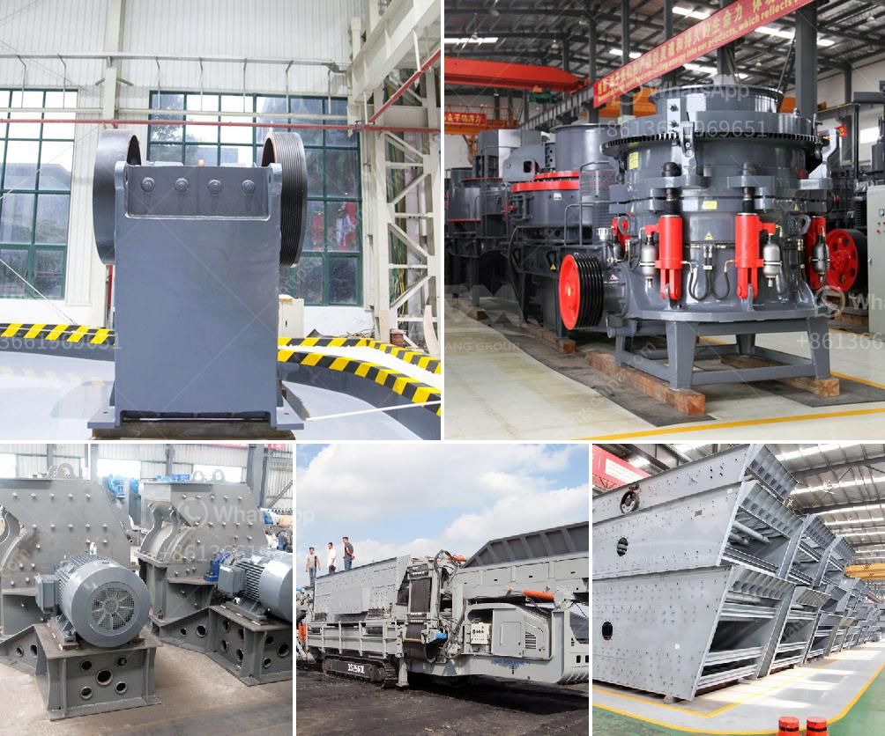

<h3>labratory hammer mill</h3>
A laboratory hammer mill is a machine used to shred or crush materials into smaller pieces for testing purposes. It is widely used in various industries such as mining, building materials, and food manufacturing. In this article, we will discuss the importance and functionality of a laboratory hammer mill.

First and foremost, the laboratory hammer mill plays a crucial role in the research and development of new products. Manufacturers and scientists rely on this equipment to analyze and test different materials and their properties. By using a laboratory hammer mill, they can determine the suitability of a material for a specific application, the particle size distribution, and the impact resistance.

Furthermore, a laboratory hammer mill is used to assess the performance of machinery and equipment. It allows manufacturers to test the durability and efficiency of their machines before they are mass-produced. By subjecting the machinery to various materials and operating conditions, they can identify any design flaws or issues that need to be addressed.

The functionality of a laboratory hammer mill is relatively simple. It consists of a chamber where the material is fed, usually through a gravity feed chute. Inside the chamber, a rotating hammer assembly is situated. The hammers are attached to a rotor that spins at high speed, effectively smashing the material into smaller pieces. The smaller particles then pass through a screen, which controls the final particle size.

The ability to control the particle size is a major advantage of a laboratory hammer mill. Different applications require different particle sizes, and this equipment allows manufacturers to achieve the desired outcome. By adjusting the screen size and controlling the speed of the rotor, they can produce particles of various sizes, ranging from coarse to fine.

Another benefit of a laboratory hammer mill is its versatility. It can handle a wide range of materials, including minerals, biomass, chemicals, and pharmaceuticals. This flexibility allows researchers and manufacturers to test various materials and assess their behavior under different processing conditions. They can also determine the optimal settings for production-scale hammer mills, ensuring efficient and consistent results.

Safety is paramount when working with a laboratory hammer mill. The machine is equipped with several safety features, such as interlocks and guards, to prevent accidents. Operators are trained to follow safety protocols and wear appropriate protective gear. Regular maintenance and inspections are also conducted to ensure the equipment is in proper working order.

In conclusion, a laboratory hammer mill is an essential tool in material testing, research, and equipment development. Its ability to shred and crush materials into smaller pieces allows manufacturers and scientists to assess their properties and performance. With its versatility and control over particle size, it offers valuable insights into various industries. However, safety and maintenance should always be a top priority to ensure a safe and efficient working environment.
<h3>Contact us</h3><ul><li><strong>Whatsapp:&nbsp;<a href="https://wa.me/8613661969651">+8613661969651</a></strong></li><li><a href="https://swt.shibang-china.com/?git&amp;zhl&amp;labratory hammer mill"><strong>Online Service(chat now)</strong></a></li></ul><h3>Related</h3><ul><li><a href='malaysia grinder hammer mill manufacturer.md'>malaysia grinder hammer mill manufacturer</a></li><li><a href='price for sand machine.md'>price for sand machine</a></li><li><a href='grinding coal mill.md'>grinding coal mill</a></li><li><a href='list of quarry company in the philippines.md'>list of quarry company in the philippines</a></li><li><a href='china cone crusher.md'>china cone crusher</a></li></ul>