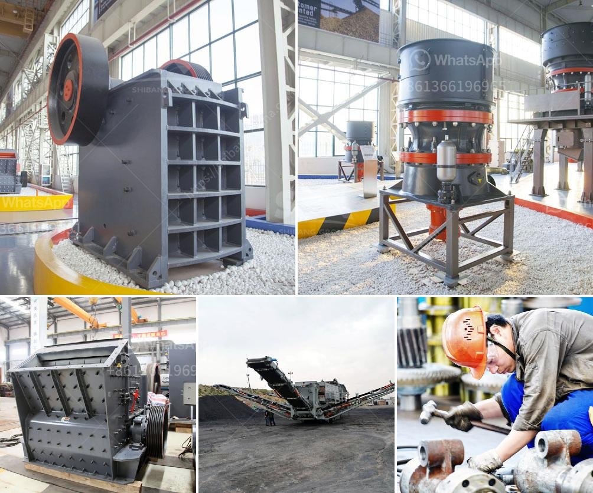

<h3>lafarge evander quartz crushers</h3>
Lafarge Evander Quartz Crushers are poised to revolutionize the quartz crushing industry with their cutting-edge technology and efficient operations. The crushers manufactured by Lafarge are specifically designed to handle quartz with precision and offer a reliable solution for crushing large quantities of this mineral.

Quartz is a popular raw material used in various industries, including construction, glass manufacturing, and electronics. However, its hardness poses a significant challenge when it comes to crushing and processing. This is where Lafarge Evander Quartz Crushers come into play, offering a powerful and efficient solution to break down quartz rocks into smaller, more manageable sizes.

One of the most impressive features of these crushers is their advanced design, incorporating state-of-the-art technology. With robust frames and heavy-duty components, these machines are built to withstand extreme conditions, ensuring durability and prolonged operational life. This reliability significantly reduces downtime, maximizing productivity and minimizing maintenance costs.

Lafarge Evander Quartz Crushers boast high crushing capacities, making them ideal for large-scale operations. Whether it's a massive mining site or a construction project, these crushers can handle high volumes of quartz rock with ease. This capability ensures a steady supply of crushed quartz, meeting the growing demands of various industries.

Furthermore, these crushers are equipped with energy-efficient motors, allowing for substantial energy savings. This not only reduces operating costs but also contributes to a greener and more sustainable production process. Lafarge is committed to environmental responsibility, and these crushers align with their dedication to minimizing the ecological footprint of their operations.

In conclusion, Lafarge Evander Quartz Crushers are a game-changer in the quartz crushing industry. With their advanced technology, impressive crushing capacities, and energy-efficient operations, these crushers offer a reliable solution for efficiently processing quartz rocks. By choosing Lafarge, industries can expect increased productivity, reduced downtime, and significant cost savings. Whether it's for construction, glass manufacturing, or electronics, Lafarge Evander Quartz Crushers are the go-to choice for reliable and efficient quartz crushing.
<h3>Contact us</h3><ul><li><strong>Whatsapp:&nbsp;<a href="https://wa.me/8613661969651">+8613661969651</a></strong></li><li><a href="https://swt.shibang-china.com/?git&amp;zhl&amp;lafarge evander quartz crushers"><strong>Online Service(chat now)</strong></a></li></ul><h3>Related</h3><ul><li><a href='portable stone crusher four screens with cone.md'>portable stone crusher four screens with cone</a></li><li><a href='calcium carbonate plant contractors.md'>calcium carbonate plant contractors</a></li><li><a href='crawler portable crusher.md'>crawler portable crusher</a></li><li><a href='stone crusher machine factory in cambodia.md'>stone crusher machine factory in cambodia</a></li><li><a href='stone crusher mobile plant south africa.md'>stone crusher mobile plant south africa</a></li></ul>